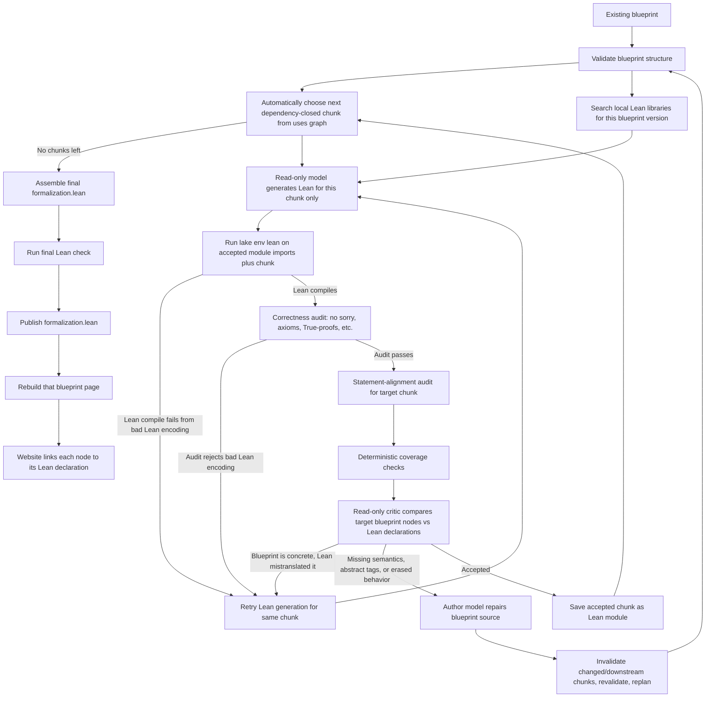

# Auto-Blueprint

Auto-Blueprint turns research papers into leanblueprint-style mathematical
blueprints and publishes them as a static site.

The repository has three layers:

1. **Generation**: `scripts/generate_blueprint.py` uses a selected model runner
   to turn a paper into `blueprints/<name>/`.
2. **Validation**: `scripts/validate_blueprint.py` checks generated blueprint
   structure deterministically before publishing.
3. **Build/deploy**: `scripts/build.py` renders validated blueprints into
   `site/`; GitHub Actions deploys `site/` to Cloudflare Pages.

## Install Locally

Use `uv`:

```bash
cd /Users/rafaelcastro/Downloads/Auto-Blueprint
uv venv --python 3.13
uv pip install -r requirements.txt
```

The web build also needs Graphviz and a LaTeX install locally. CI installs these
automatically.

Lean is not a Python package, so it is not installed by `requirements.txt`.
Auto-Blueprint declares Lean separately with:

```text
lean-toolchain
lakefile.lean
```

To install the repo-pinned Lean/Lake/Mathlib setup locally, run:

```bash
uv run python scripts/setup_lean.py --install-elan
```

That installs `elan` if needed, then runs `lake update` and downloads the
Mathlib cache for this repository.

## Web UI

Everything below can also be driven from a local browser dashboard instead of
the command line:

```bash
uv run python scripts/webui.py
```

That serves `http://127.0.0.1:8321` (use `--port` to change it, `--no-open` to
skip opening the browser) and provides:

- a **Generate** tab: paper path/URL or drag-and-drop PDF upload, blueprint
  name, runner/model pickers, and the `--force` / `--no-build` flags;
- a **Refine with Lean** tab wrapping `scripts/refine_blueprint_with_lean.py`,
  with blueprint picker, max trials, and optional paper context;
- **Validate** and **Build site** tabs wrapping the corresponding scripts;
- a live log console streaming the running script's output, with a Stop button;
- a blueprint list with links to the rendered pages, served from `site/`.

The UI shells out to the same scripts documented below with the same flags, so
behavior is identical to the command line. It runs one job at a time, binds to
localhost only, and needs no extra dependencies.

## Build Existing Blueprints

Build everything:

```bash
uv run python scripts/build.py --strict
```

Build one blueprint:

```bash
uv run python scripts/build.py batch-codes
```

The build runs the validator before rendering each blueprint.

## Generate A New Blueprint

The entrypoint is:

```bash
uv run python scripts/generate_blueprint.py <paper> --name <blueprint-name> --runner <runner>
```

`<paper>` may be:

- a text/LaTeX file;
- a PDF file, if `pdftotext` is installed locally;
- a URL to text/HTML;
- a URL to a PDF, if `pdftotext` is installed locally;
- pasted paper text.

The generated blueprint appears under:

```text
blueprints/<blueprint-name>/
```

Then `scripts/build.py` renders it into:

```text
site/<blueprint-name>/
```

## Two Generation Modes

Auto-Blueprint supports two model modes.

### Mode 1: Agent Mode

Agent mode uses a local coding agent CLI, such as Codex CLI or Claude Code.

Examples:

```bash
uv run python scripts/generate_blueprint.py papers/foo.pdf \
  --name foo \
  --runner codex
```

```bash
uv run python scripts/generate_blueprint.py papers/foo.pdf \
  --name foo \
  --runner claude-code
```

By default, `--runner codex` uses whatever model your Codex app/CLI is already
configured to use. On this machine, that is currently `gpt-5.5`, which is the
CLI model name behind the UI label "GPT-5.5".

With a specific Codex model:

```bash
uv run python scripts/generate_blueprint.py papers/foo.pdf \
  --name foo \
  --runner codex:gpt-5.5
```

Set Codex reasoning effort for harder papers:

```bash
uv run python scripts/generate_blueprint.py papers/foo.pdf \
  --name foo \
  --runner codex:gpt-5.5 \
  --reasoning-effort high
```

Do not use `codex:gpt-5-codex` unless your Codex account explicitly supports
that exact model. For a ChatGPT-backed Codex app, `gpt-5.5` is the model string
shown by your local Codex config.

Supported reasoning values are:

```text
low
medium
high
xhigh
```

Internally this passes Codex:

```text
-c model_reasoning_effort="high"
```

```bash
uv run python scripts/generate_blueprint.py papers/foo.pdf \
  --name foo \
  --runner claude-code:opus
```

Agent mode works like the original `.claude/skills/paper-to-blueprint` workflow:

1. The runner receives the paper plus the paper-to-blueprint instructions.
2. The runner may inspect and edit the repo.
3. The runner runs `scripts/new_blueprint.py`.
4. The runner writes `content.tex`, `web.tex`, and `print.tex`.
5. The runner runs `scripts/validate_blueprint.py <name>`.
6. The runner runs `scripts/build.py <name>`.
7. The runner reports what it created.

Use agent mode when you want the model to behave like a coding collaborator
inside the repository. It is flexible and can recover from build errors, but it
also means the model is allowed to edit files directly.

### Mode 2: API Mode

API mode uses a model API. The model does **not** edit files. It returns a JSON
object, and Auto-Blueprint writes files itself.

OpenAI:

```bash
export OPENAI_API_KEY="..."

uv run python scripts/generate_blueprint.py papers/foo.txt \
  --name foo \
  --runner openai:gpt-5
```

Anthropic:

```bash
export ANTHROPIC_API_KEY="..."

uv run python scripts/generate_blueprint.py papers/foo.txt \
  --name foo \
  --runner anthropic:claude-sonnet-4-5
```

API mode asks the model for JSON shaped like:

```json
{
  "name": "foo",
  "title": "Paper Title",
  "authors": "Paper Authors",
  "description": "One-line landing page summary",
  "home": "https://arxiv.org/abs/...",
  "github": "",
  "build_pdf": false,
  "content_tex": "\\chapter{Introduction}\\n..."
}
```

Then Auto-Blueprint:

1. creates `blueprints/<name>/` from `templates/blueprint-skeleton/`;
2. writes `meta.yml`;
3. writes `blueprint/src/content.tex`;
4. updates `web.tex` and `print.tex` title/author fields;
5. runs `scripts/validate_blueprint.py <name>`;
6. runs `scripts/build.py <name>` unless `--no-build` is passed.

Use API mode for a production-style pipeline: model output is data, and local
code decides what files are written.

### Offline Smoke Test

The mock runner creates a tiny blueprint without calling a real model:

```bash
uv run python scripts/generate_blueprint.py "mock input text long enough to pass the length check ..." \
  --name mock-paper \
  --runner mock \
  --force \
  --no-build
```

Then validate it:

```bash
uv run python scripts/validate_blueprint.py mock-paper
```

## Validator

`scripts/validate_blueprint.py` is the deterministic gate between model output
and publishing.

It checks:

- blueprint source files exist;
- `meta.yml` name matches the folder;
- theorem-like environments have labels;
- labels are unique;
- every `\uses{...}` points to an existing label;
- the dependency graph has no cycles;
- `\input` / `\include` can split content across local `.tex` files, but
  generated LaTeX cannot read files outside that blueprint's `src/` folder;
- `\mathlibok` without `\lean{...}` is reported as a warning.

Validation is not mathematical proof checking. It is a structural safety and
quality gate for generated blueprints.

## Lean-Guided Refinement

After a blueprint exists, you can run the author/critic loop:

```bash
uv run python scripts/refine_blueprint_with_lean.py my-paper \
  --paper /Users/rafaelcastro/Downloads/pseudo-rand-gen.pdf \
  --runner codex \
  --reasoning-effort high \
  --max-trials 3
```

This loop is intentionally different from “ask the model to hack Lean until it
passes.”



Each chunk loop does this:

1. validate the current blueprint structure;
2. automatically choose the next dependency-closed chunk from the `\uses{...}`
   graph;
3. search local Lean libraries for this blueprint version;
4. make a read-only model call that sees the whole dependency graph, the target
   node source, relevant unresolved dependency source, accepted Lean signatures,
   and local library candidates, then ask it to generate Lean only for the
   target chunk;
5. save accepted chunks as temporary Lean modules and run `lake env lean` on
   imports of those modules plus the new chunk;
6. if Lean compiles, run correctness and statement-alignment audits for the
   target chunk;
7. if Lean/audit fails because the blueprint is concrete but the Lean
   translation is bad, retry Lean generation for the same chunk;
8. if Lean/audit fails because the blueprint is missing
   mathematical content, is too abstract, or lets Lean erase the intended
   behavior, make a second model call with the blueprint plus the critic output;
9. require that second call to edit the blueprint, not the Lean file;
10. after a blueprint repair, revalidate the whole blueprint and invalidate
    only changed nodes plus downstream nodes that depend on them;
11. if the chunk passes, save it as a generated Lean module and move to the
    next chunk;
12. when all chunks pass, assemble a standalone `formalization.lean`, run a
    final Lean check, and publish it.

So a blueprint-content failure has two model phases:

```text
blueprint + current chunk -> model generates Lean -> script runs Lean + audit -> Lean/audit errors
Lean/audit errors + blueprint -> model repairs blueprint
```

The next pass then starts over from the repaired blueprint:

```text
repaired blueprint -> replan chunks -> model generates fresh Lean for the next chunk
```

Lean and audit errors are therefore still used to repair the blueprint. Chunking
only changes the size of the Lean obligation; the blueprint remains the source
of truth. You do not normally choose a chunk size: the script traverses the
dependency graph from the currently-ready frontier and uses an internal batch
limit. There is an advanced `--chunk-size` override for experiments, but the
Web UI intentionally hides it. After a blueprint repair, accepted chunks whose
node text did not change are kept; changed nodes and their downstream
dependents are regenerated.

Accepted chunks are cached as generated Lean modules under
`AutoBlueprint/Generated/<BlueprintName>/ChunkNN.lean` during the run. Later
chunks import those modules, and the model sees compact accepted declaration
signatures instead of thousands of lines of prior Lean source. These module
files are scratch cache and ignored by Git. When all chunks pass, the script
assembles a standalone `blueprints/<name>/blueprint/lean/formalization.lean`
for the website and for Git.

The Lean-generation prompt is deliberately scoped. It does not resend the full
TeX source of every blueprint node on every chunk. It sends the global node
graph for orientation, then only the target chunk source plus unresolved
dependency source. Blueprint repair calls still receive the broader blueprint
context because those calls are allowed to edit the blueprint itself.

The local library search is done once per blueprint version/chunk pass, not once
per Lean retry. It searches installed local Lean libraries, currently Mathlib
and any CS Lib checkout found under `.lake/packages/`, for likely
declarations/modules. If deterministic search finds too little, the read-only
model proposes extra search terms, then deterministic search runs again. The
resulting candidate list is reused for every Lean-generation retry in that
chunk.

Lean-generation failures are handled differently. If the generated Lean fails
because of syntax, bad imports, implicit-argument problems, missing explicit
types, unknown identifiers, or the correctness audit below, the script retries
Lean generation from the same blueprint instead of changing the blueprint.
This retry count is internal; the user-facing bound is `--max-trials`, which
counts blueprint-repair trials.

By default, generated Lean must pass a correctness audit:

- no `sorry`;
- no `admit`;
- no `by ?`;
- no vacuous `theorem`/`lemma`/`example` declarations whose statement is just
  `True`;
- no `axiom`;
- no `constant`;
- no `opaque`;
- `set_option autoImplicit false` is required.

This prevents a false success where Lean compiles only because the paper's
actual results were declared as assumptions. There is no user-facing override
for this in the refinement loop.

After Lean compiles, the file must also pass a statement-alignment audit before
it is published. This audit has two layers:

- deterministic coverage checks: every non-`\mathlibok` blueprint node must
  have the expected generated Lean declaration name, such as
  `lem:inner-scaled` -> `lem_inner_scaled`;
- a separate read-only critic model compares each blueprint node with its Lean
  declaration and rejects publication if the Lean statement weakens the claim,
  drops parameters or hypotheses, replaces concrete claims by placeholders, or
  is too abstract to represent the blueprint.

Those audit failures are routed differently depending on what went wrong. If
the blueprint already states the mathematics concretely and the generated Lean
just encoded it badly, the script retries Lean generation. If the audit says
the Lean could only pass by using abstract tags, missing semantics, erased
behavior, dropped hypotheses, or similarly weak statements, the script treats
that as a blueprint-repair failure and asks the author model to strengthen the
blueprint before trying Lean again.

So "Lean compiles" means the proof is valid for the Lean statement, but
Auto-Blueprint now requires "Lean compiles and the statement audit accepts" to
publish the file.

The generation call (step 2) constructs its runner with `readonly=True`, a
contract every backend honors: `claude-code` hard-blocks the shell and edit
tools, `codex` sets its sandbox to `read-only`, and the API backends
(`anthropic`, `openai`, `mock`) are read-only by construction since they only
return text. The model writes one Lean file as its reply and this script does
the single compile check, so agent sessions cannot spend long stretches
re-running `lake env lean`. Attempts are asked to import only the specific
Mathlib modules they need rather than the blanket `import Mathlib`, which
keeps each compile check to seconds instead of minutes. The repair step
(step 5) keeps normal repo access, since it must edit blueprint files.

The script stops when Lean compiles and the statement-alignment audit accepts,
or when `--max-trials` is reached. Disposable Lean attempts and reports are
written under:

```text
.auto-blueprint/formalization/
```

That directory is ignored by Git.

Each refinement run also writes a timestamped raw transcript:

```text
.auto-blueprint/formalization/<name>/run-YYYYMMDD-HHMMSS.log
```

The shorter `report.md` links to that log. Use the log when you need the full
terminal output for model calls, Lean failures, audit failures, and rebuild
output.

If the read-only model call times out or fails before producing Lean, the run
stops without changing the blueprint and writes a fresh `report.md` for that
same run. That prevents an old report from looking like the current failure.

If Lean passes, the passing attempt is promoted out of scratch space and saved
as:

```text
blueprints/<name>/blueprint/lean/formalization.lean
```

The refinement script then rebuilds that blueprint automatically. The rebuilt
site contains:

```text
site/<name>/lean/index.html
site/<name>/lean/formalization.lean
```

The blueprint page and the landing page link to `lean/index.html`, a readable
static Lean viewer with line numbers and a link to the raw
`formalization.lean` source. When a generated declaration name matches a
blueprint node label, for example `def:gamma-minip` -> `def_gamma_minip`, the
rendered node heading also gets a local `Lean` link to that exact line in the
viewer. The older checkmarks on `\mathlibok` nodes still mean "already in
Mathlib"; generated formalizations use local `Lean` links instead. Failed Lean
attempts are not published and do not trigger a site rebuild.

## Deployment

Deployment is automatic after pushing to GitHub.

On push to `main`, GitHub Actions:

1. installs Python, Graphviz, LaTeX, and Python dependencies;
2. runs `python scripts/build.py --strict`;
3. creates the Cloudflare Pages project if needed;
4. deploys `site/` to Cloudflare Pages.

Required GitHub repository secrets:

```text
CLOUDFLARE_ACCOUNT_ID
CLOUDFLARE_API_TOKEN
```

Do not commit `site/`; it is generated by the build.

## Current Boundary

Auto-Blueprint now has three separate layers:

1. paper to blueprint;
2. Lean-guided blueprint refinement;
3. static site publishing.

The Lean refinement loop is a critic for blueprint quality. The generated Lean
files are disposable test artifacts; the blueprint remains the source of truth.
