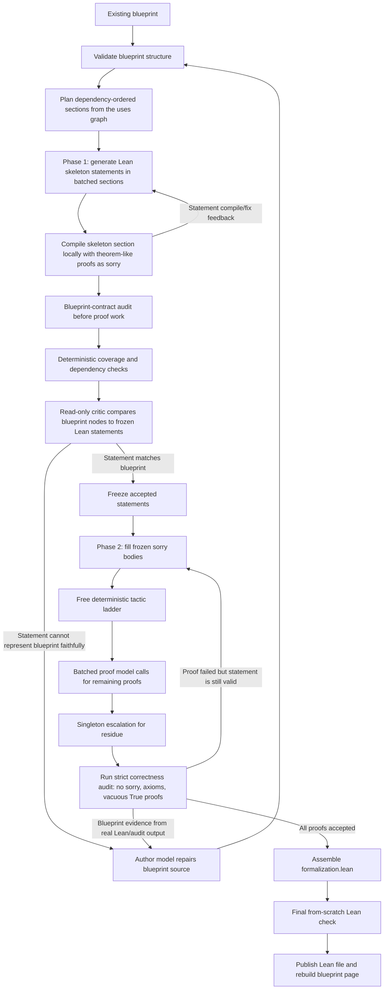
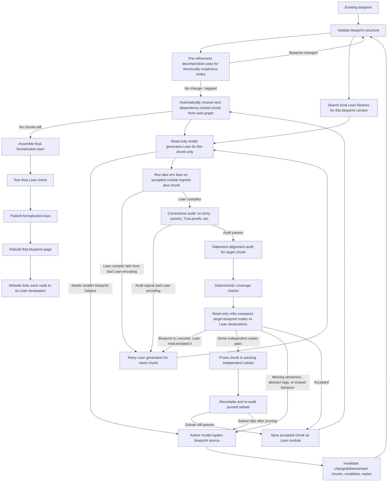

# Auto-Blueprint

Auto-Blueprint turns research papers into leanblueprint-style mathematical
blueprints and publishes them as a static site.

The repository has three layers:

1. **Generation**: `scripts/generate_blueprint.py` uses a selected model runner
   to turn a paper into `blueprints/<name>/`.
2. **Validation**: `scripts/validate_blueprint.py` checks generated blueprint
   structure deterministically before publishing.
3. **Build/deploy**: `scripts/build.py` renders validated blueprints into
   `site/`; GitHub Actions deploys `site/` to Cloudflare Pages.

## Install Locally

Use `uv`:

```bash
cd /Users/rafaelcastro/Downloads/Auto-Blueprint
uv venv --python 3.13
uv pip install -r requirements.txt
```

The web build also needs Graphviz and a LaTeX install locally. CI installs these
automatically.

Lean is not a Python package, so it is not installed by `requirements.txt`.
Auto-Blueprint declares Lean separately with:

```text
lean-toolchain
lakefile.lean
```

To install the repo-pinned Lean/Lake/Mathlib setup locally, run:

```bash
uv run python scripts/setup_lean.py --install-elan
```

That installs `elan` if needed, then runs `lake update` and downloads the
Mathlib cache for this repository.

## Web UI

Everything below can also be driven from a local browser dashboard instead of
the command line:

```bash
uv run python scripts/webui.py
```

That serves `http://127.0.0.1:8321` (use `--port` to change it, `--no-open` to
skip opening the browser) and provides:

- a **Generate** tab: paper path/URL or drag-and-drop PDF upload, blueprint
  name, runner/model pickers, and the `--force` / `--no-build` flags;
- a **Refine with Lean** tab wrapping `scripts/refine_blueprint_with_lean.py`,
  with blueprint picker, max trials, and optional paper context;
- **Validate** and **Build site** tabs wrapping the corresponding scripts;
- a live log console streaming the running script's output, with a Stop button;
- a blueprint list with links to the rendered pages, served from `site/`.

The UI shells out to the same scripts documented below with the same flags, so
behavior is identical to the command line. It runs one job at a time, binds to
localhost only, and needs no extra dependencies.

## Build Existing Blueprints

Build everything:

```bash
uv run python scripts/build.py --strict
```

Build one blueprint:

```bash
uv run python scripts/build.py batch-codes
```

The build runs the validator before rendering each blueprint.

## Generate A New Blueprint

The entrypoint is:

```bash
uv run python scripts/generate_blueprint.py <paper> --name <blueprint-name> --runner <runner>
```

`<paper>` may be:

- a text/LaTeX file;
- a PDF file, if `pdftotext` is installed locally;
- a URL to text/HTML;
- a URL to a PDF, if `pdftotext` is installed locally;
- pasted paper text.

The generated blueprint appears under:

```text
blueprints/<blueprint-name>/
```

Then `scripts/build.py` renders it into:

```text
site/<blueprint-name>/
```

## Two Generation Modes

Auto-Blueprint supports two model modes.

### Mode 1: Agent Mode

Agent mode uses a local coding agent CLI, such as Codex CLI or Claude Code.

Examples:

```bash
uv run python scripts/generate_blueprint.py papers/foo.pdf \
  --name foo \
  --runner codex
```

```bash
uv run python scripts/generate_blueprint.py papers/foo.pdf \
  --name foo \
  --runner claude-code
```

By default, `--runner codex` uses whatever model your Codex app/CLI is already
configured to use. On this machine, that is currently `gpt-5.5`, which is the
CLI model name behind the UI label "GPT-5.5".

With a specific Codex model:

```bash
uv run python scripts/generate_blueprint.py papers/foo.pdf \
  --name foo \
  --runner codex:gpt-5.5
```

Set Codex reasoning effort for harder papers:

```bash
uv run python scripts/generate_blueprint.py papers/foo.pdf \
  --name foo \
  --runner codex:gpt-5.5 \
  --reasoning-effort high
```

Do not use `codex:gpt-5-codex` unless your Codex account explicitly supports
that exact model. For a ChatGPT-backed Codex app, `gpt-5.5` is the model string
shown by your local Codex config.

Supported reasoning values are:

```text
low
medium
high
xhigh
```

Internally this passes Codex:

```text
-c model_reasoning_effort="high"
```

```bash
uv run python scripts/generate_blueprint.py papers/foo.pdf \
  --name foo \
  --runner claude-code:opus
```

Agent mode works like the original `.claude/skills/paper-to-blueprint` workflow:

1. The runner receives the paper plus the paper-to-blueprint instructions.
2. The runner may inspect and edit the repo.
3. The runner runs `scripts/new_blueprint.py`.
4. The runner writes `content.tex`, `web.tex`, and `print.tex`.
5. The runner runs `scripts/validate_blueprint.py <name>`.
6. The runner runs `scripts/build.py <name>`.
7. The runner reports what it created.

Use agent mode when you want the model to behave like a coding collaborator
inside the repository. It is flexible and can recover from build errors, but it
also means the model is allowed to edit files directly.

### Mode 2: API Mode

API mode uses a model API. The model does **not** edit files. It returns a JSON
object, and Auto-Blueprint writes files itself.

OpenAI:

```bash
export OPENAI_API_KEY="..."

uv run python scripts/generate_blueprint.py papers/foo.txt \
  --name foo \
  --runner openai:gpt-5
```

Anthropic:

```bash
export ANTHROPIC_API_KEY="..."

uv run python scripts/generate_blueprint.py papers/foo.txt \
  --name foo \
  --runner anthropic:claude-sonnet-4-5
```

API mode asks the model for JSON shaped like:

```json
{
  "name": "foo",
  "title": "Paper Title",
  "authors": "Paper Authors",
  "description": "One-line landing page summary",
  "home": "https://arxiv.org/abs/...",
  "github": "",
  "build_pdf": false,
  "content_tex": "\\chapter{Introduction}\\n..."
}
```

Then Auto-Blueprint:

1. creates `blueprints/<name>/` from `templates/blueprint-skeleton/`;
2. writes `meta.yml`;
3. writes `blueprint/src/content.tex`;
4. updates `web.tex` and `print.tex` title/author fields;
5. runs `scripts/validate_blueprint.py <name>`;
6. runs `scripts/build.py <name>` unless `--no-build` is passed.

Use API mode for a production-style pipeline: model output is data, and local
code decides what files are written.

### Offline Smoke Test

The mock runner creates a tiny blueprint without calling a real model:

```bash
uv run python scripts/generate_blueprint.py "mock input text long enough to pass the length check ..." \
  --name mock-paper \
  --runner mock \
  --force \
  --no-build
```

Then validate it:

```bash
uv run python scripts/validate_blueprint.py mock-paper
```

## Validator

`scripts/validate_blueprint.py` is the deterministic gate between model output
and publishing.

It checks:

- blueprint source files exist;
- `meta.yml` name matches the folder;
- theorem-like environments have labels;
- labels are unique;
- every `\uses{...}` points to an existing label;
- the dependency graph has no cycles;
- `\input` / `\include` can split content across local `.tex` files, but
  generated LaTeX cannot read files outside that blueprint's `src/` folder;
- `\mathlibok` without `\lean{...}` is reported as a warning.

Validation is not mathematical proof checking. It is a structural safety and
quality gate for generated blueprints.

## Lean Formalization (statements-first, recommended)

After a blueprint exists, the recommended way to formalize it is the
statements-first pipeline:

```bash
uv run python scripts/formalize_blueprint.py my-paper \
  --paper /path/to/paper.pdf \
  --runner codex \
  --workers 3
```

The blueprint is still the only source of truth and Lean is still the critic;
this pipeline changes *when* model calls happen and how much each one does, so
a 150-node paper takes tens of model calls instead of hundreds:

1. **Phase 1 — skeleton.** Batched calls generate one Lean declaration per
   blueprint node, ~24 nodes per call, in dependency order: real bodies for
   definition nodes, `:= sorry` proofs for theorem-like nodes. Each section is
   compiled locally, compile errors are fixed in batched rounds, and the
   blueprint-contract audit (deterministic coverage checks plus one batched
   model audit per section) runs on the statements and proof obligations
   **before** any proof effort is spent. If deterministic checks isolate only a
   few bad declarations inside an otherwise useful section, Phase 1 asks for
   replacements for those declarations only, then recompiles and audits the
   whole section again. Accepted statements are frozen: later phases can only
   replace `sorry` bodies — the harness splices proofs into the frozen file
   itself, so a model cannot silently reshape a statement.
2. **Phase 2 — proofs.** For every frozen `sorry`, a deterministic tactic
   ladder (`rfl`/`omega`/`norm_num`/`ring`/`simp`/`aesop`) runs first at zero
   model cost; survivors are filled by batched model calls
   (`--proof-batch-size`, default 12 proofs per call) running in parallel
   across sections (`--workers`); the residue escalates to singleton calls at
   `--escalation-effort` (default `high`). Sections are independent once
   statements are frozen, so proof order does not matter.
3. **Repair — evidence only.** A timed-out model call is treated as latency,
   never as mathematical difficulty: batches are bisected, targeted declaration
   patches are used for small skeleton failures, and singletons are retried at
   higher effort. A base-model skeleton `NEEDS-DECOMPOSITION` response is
   treated as a generator claim, not immediate repair evidence: Phase 1 first
   retries the same section through the escalation runner, allowing complete
   local helper declarations when needed. Blueprint repair calls whose target
   still contains multiple labels are also split on timeout instead of treating
   latency as mathematical evidence. Only real Lean/audit output, an escalated
   `NEEDS-DECOMPOSITION` refusal, or a statement that cannot even be *stated*
   within two full escalated budgets can trigger a blueprint repair (bounded
   by `--max-trials`, default 8). If the same Phase-1 section keeps returning
   to repair after ordinary skeleton fixes, the pipeline performs one
   constrained section-normalization pass: the escalation runner may rewrite
   only that stuck section plus immediate helper nodes, the result is validated,
   and it is rejected/rolled back if it changes too many node contracts. If the
   section still churns after normalization, the run stops with a report rather
   than spending the whole trial budget. Repairs invalidate downstream nodes by
   the full per-node blueprint contract, including the proof sketch, so
   accepted Lean is rechecked when the blueprint proof it is supposed to
   certify changes. Invalidated declarations are pruned out of frozen sections
   deterministically.

The published contract is unchanged: `formalization.lean` contains no
`sorry`, passes the strict correctness audit, is recompiled from scratch as a
final gate, and every declaration corresponds 1-1 to a blueprint node.
`sorry` exists only inside the internal scratch skeleton under
`AutoBlueprint/Generated/<Name>/SkeletonNN.lean`, which is never published.

Every dependency contract is still enforced: a node whose blueprint entry
`\uses{...}` another node must visibly use that node's generated Lean name.
For definitions this is checked when the statement freezes; for theorem-like
nodes it is checked as soon as the proof exists, and a proof that re-derives a
dependency inline is rejected.

Useful flags: `--section-size` (statements per Phase-1 call, default 24),
`--proof-batch-size` (proofs per Phase-2 call, default 12), `--workers`
(parallel proof workers, default 3), `--runner` (base runner/model for batched
calls; when omitted, the CLI uses the same cheap-API-first preset as the Web
UI), `--reasoning-effort` (codex effort for batched calls, default `medium`),
`--escalation-runner` (runner/model for singleton retries and blueprint repair;
when `--runner` is explicitly set, the CLI default is the same runner, otherwise
it uses the stronger half of the auto preset),
`--escalation-effort` (codex effort for escalation calls, default `high`),
`--timeout`/`--hard-timeout` (per-call budgets, defaults 300/600 s),
`--no-ladder`, `--no-build`, and `--continue`. For non-Codex runners,
`--reasoning-effort`/`--escalation-effort` do not change model strength; use
different `--runner` and `--escalation-runner` model specs instead.
`--continue` reloads
`skeleton_state.json`, keeps every section whose file hash, blueprint statement
fingerprints, and full proof-contract fingerprints still match (cascading
invalidation through blueprint descendants), and resumes from the first stale
node.

The Web UI **Refine with Lean** tab runs this pipeline by default. Its preset
is intentionally two-tiered:

- If `OPENAI_API_KEY` is set, the UI/CLI calls OpenAI's `GET /v1/models`,
  fills the dropdown from the returned model IDs, and chooses a base model from
  the live list using cheap-tier class markers such as `mini`/`nano`; escalation
  is chosen from non-`mini`/`nano` text models in the same live list.
- Else, if `ANTHROPIC_API_KEY` is set, the UI/CLI calls Anthropic's
  `GET /v1/models`, fills the dropdown from the returned model IDs, chooses a
  `haiku`-class base model when available, and chooses a non-`haiku`
  `sonnet`/`opus`-class escalation model when available.
- Else, it falls back to local Codex by reading `codex debug models`, filling
  the dropdown from the returned model slugs, and choosing a lighter base model
  plus a stronger escalation model from that catalog.

The model fields remain editable because provider/account model availability
can differ, and model-list calls can fail offline. Leave a model field blank to
use that runner's default. Uncheck "Fast
statements-first pipeline" to fall back to the legacy loop below.

The explicit OpenAI-style CLI shape, if you want to pin model names yourself,
is:

```bash
uv run python scripts/formalize_blueprint.py subquadratic-transformers \
  --runner openai:gpt-5-mini \
  --escalation-runner openai:gpt-5 \
  --timeout 300 \
  --hard-timeout 600 \
  --workers 3 \
  --continue
```

Fast pipeline diagram:



## Legacy Lean-Guided Refinement (per-chunk loop)

The original per-chunk author/critic loop is still available:

```bash
uv run python scripts/refine_blueprint_with_lean.py my-paper \
  --paper /Users/rafaelcastro/Downloads/pseudo-rand-gen.pdf \
  --runner codex \
  --reasoning-effort high \
  --max-trials 3 \
  --timeout 300 \
  --hard-timeout 600
```

It generates and audits one dependency-closed chunk (usually one node) per
model call, sequentially. It is significantly slower and more call-hungry than
the statements-first pipeline and routes model-call timeouts into blueprint
decomposition; prefer `scripts/formalize_blueprint.py` unless you specifically
want the old behavior.

This loop is intentionally different from “ask the model to hack Lean until it
passes.”

Legacy loop diagram:



Before chunking starts, the script runs a bounded pre-refinement decomposition
pass unless `--no-pre-decompose` is set. The deterministic prepass selects a
small number of unresolved nodes with formalization-risk signals such as long
proofs, several displayed equations, finite sums/products, reindexing language,
or many equation-like steps. A model may then edit the blueprint to split those
nodes into smaller helper definitions/lemmas. If it changes the blueprint, that
change is validated and counted as one blueprint-repair trial; Lean generation
then starts from the updated blueprint. This does not create a side plan: the
blueprint source is still what Lean must implement one-to-one.

Each chunk loop then does this:

1. validate the current blueprint structure;
2. automatically choose the next dependency-closed chunk from the `\uses{...}`
   graph;
3. search local Lean libraries for this blueprint version;
4. make a read-only model call that sees the whole dependency graph, the target
   node source, relevant unresolved dependency source, accepted Lean signatures,
   local library candidates with declaration snippets, and a small Lean idiom
   sheet, then ask it to generate Lean only for the target chunk. If the model
   determines that a target node cannot be formalized faithfully as one public
   Lean declaration from the current blueprint text, it may return
   `NEEDS-DECOMPOSITION: {...}` instead of weakened Lean; that is routed to
   blueprint repair so the node can be split into explicit helper nodes by the
   refinement loop;
5. save accepted chunks as temporary Lean modules and run `lake env lean` on
   imports of those modules plus the new chunk;
6. if Lean compiles, run correctness and statement-alignment audits for the
   target chunk;
7. if Lean/audit fails because the blueprint is concrete but the Lean
   translation is bad, retry Lean generation for the same chunk;
8. if Lean/audit fails because the blueprint is missing
   mathematical content, is too abstract, lets Lean erase the intended
   behavior, or the Lean generator explicitly requests decomposition, make a
   second model call with the blueprint plus the critic output;
9. require that second call to edit the blueprint, not the Lean file;
10. when a statement audit rejects only part of a chunk, compute the rejected
    nodes' downstream closure inside that chunk; if unrelated nodes remain,
    prune the generated module so it exposes only those unrelated nodes, then
    re-run Lean and the statement audit before keeping that subset;
11. after a blueprint repair, revalidate the whole blueprint and invalidate
    only changed nodes plus downstream nodes that depend on them;
12. if the chunk or a verified independent subset passes, save it as a generated
    Lean module and move to the
    next chunk;
13. when all chunks pass, assemble a standalone `formalization.lean`, run a
    final Lean check, and publish it.

Blueprint decomposition is part of refinement, not a manual preprocessing step.
The checked-in blueprint should not be hand-edited just to pre-split one
paper's hard node. When a node looks too large before Lean generation, the
pre-refinement pass may split it first. When that was not enough, or when a
node only becomes obviously underspecified after generated Lean/audit feedback,
the normal repair path can still split it later from the Lean/audit failure or
`NEEDS-DECOMPOSITION` response.

So a blueprint-content failure has two model phases:

```text
blueprint + current chunk -> model generates Lean -> script runs Lean + audit -> Lean/audit errors
Lean/audit errors + blueprint -> model repairs blueprint
```

The next pass then starts over from the repaired blueprint:

```text
repaired blueprint -> replan chunks -> model generates fresh Lean for the next chunk
```

The loop does not train or update the model. Each author, critic, and Lean
generation step is a fresh model call. Information carries forward only through
the edited blueprint source, accepted Lean modules, the current prompt, and the
failure text explicitly included in that prompt. This means a later call can
repeat a modeling mistake if the previous repair did not make the missing
requirement concrete in the blueprint. The system handles that by rejecting the
weak Lean again and forcing another blueprint repair.

If a blueprint repair produces no parsed node-text changes, the run no longer
keeps blindly spending the same repair shape forever. It first escalates with
explicit instructions, then forces decomposition mode for the stuck node(s), and
if those repair strategies still no-op, it regenerates with the accumulated
audit history until the `--max-trials` budget is exhausted.

Lean and audit errors are therefore still used to repair the blueprint. Chunking
only changes the size of the Lean obligation; the blueprint remains the source
of truth. You do not normally choose a chunk size: the script traverses the
dependency graph from the currently-ready frontier with a deterministic
difficulty-aware scheduler. Straightforward definitions and small lemmas can be
batched, a few medium nodes can share a chunk, and theorem/reduction/hardness
nodes are isolated as singleton chunks. The classifier uses only blueprint
metadata and text features such as node kind, proof size, dependency count, and
keywords like reduction, hardness, runtime, transfer, approximation, tensor,
SETH, and OVC. There is an advanced `--chunk-size` override for experiments,
but it is an upper bound; it does not force hard nodes to be mixed with other
work. The Web UI intentionally hides it.

After a blueprint repair, accepted chunks whose node text did not change are
kept; changed nodes and their downstream dependents are regenerated. A failed
chunk is not always thrown away wholesale: if the audit identifies specific
rejected nodes, the script can keep unrelated nodes from the same chunk, but
only after removing the rejected/downstream public declarations from the module,
recompiling that pruned module, and re-running the statement audit on the kept
subset.

Accepted chunks are cached as generated Lean modules under
`AutoBlueprint/Generated/<BlueprintName>/ChunkNN.lean` during the run. Later
chunks import those modules, and the model sees compact accepted declaration
signatures instead of thousands of lines of prior Lean source. These module
files are scratch cache and ignored by Git. When all chunks pass, the script
assembles a standalone `blueprints/<name>/blueprint/lean/formalization.lean`
for the website and for Git.

The Lean-generation prompt is deliberately scoped. It does not resend the full
TeX source of every blueprint node on every chunk. It sends the global node
graph for orientation, then only the target chunk source plus unresolved
dependency source. Blueprint repair calls still receive the broader blueprint
context because those calls are allowed to edit the blueprint itself.

The local library search is done once per blueprint version/chunk pass, not once
per Lean retry. It searches installed local Lean libraries, currently Mathlib
and any CS Lib checkout found under `.lake/packages/`, for likely
declarations/modules. Candidate modules are found deterministically and shown to
the model with short declaration snippets, so the model should treat those module
paths as already verified instead of reopening Mathlib to check them. If
deterministic search finds too little, the read-only model proposes extra search
terms, then deterministic search runs again. The resulting candidate list is
reused for every Lean-generation retry in that chunk.

`--timeout` is the base wall-clock budget for each non-deterministic model
call made by the refinement loop. It is not a whole-run timeout and it does not
control deterministic Lean compilation checks, which have their own fixed
timeouts. The default is 300 seconds so ordinary chunks cannot silently spend
10-20 minutes in a single model call. `--hard-timeout` is the per-call budget
used when the scheduler classifies the current target chunk as hard; it must be
at least `--timeout` and defaults to 600 seconds. The Web UI exposes both
fields in the **Refine with Lean** tab. If a model call hits its budget, the
runner reports a timeout and the refinement loop handles that as a failed model
attempt or, when appropriate, escalates to blueprint repair/decomposition.
Timeouts before any Lean code is returned are handled specially because retrying
the same oversized prompt usually just wastes another full timeout window. If a
multi-node chunk times out, the scheduler immediately replans those labels as
singleton chunks and uses the hard-node timeout for them. If a singleton chunk
times out at the base timeout, the scheduler first reclassifies that node as
hard and retries it with `--hard-timeout`. Only if a singleton chunk times out
again with the hard-node timeout does the run treat that as evidence that the
blueprint node may be too large or underspecified to formalize faithfully as one
declaration and route it to blueprint decomposition. Timeout routing hints are
stored under `.auto-blueprint/formalization/<name>/routing_hints.json`, so a
later `--continue` run does not have to rediscover the same timeout pattern from
scratch.

Lean-generation failures are handled differently. If the generated Lean fails
because of syntax, bad imports, implicit-argument problems, missing explicit
types, unknown identifiers, or the correctness audit below, the script retries
Lean generation from the same blueprint instead of changing the blueprint.
This retry count is internal; the user-facing bound is `--max-trials`, which
counts blueprint-repair trials.

By default, generated Lean must pass a correctness audit:

- no `sorry`;
- no `admit`;
- no `by ?`;
- no vacuous `theorem`/`lemma`/`example` declarations whose statement is just
  `True`;
- no `axiom`;
- no `constant`;
- no `opaque`;
- `set_option autoImplicit false` is required.

This prevents a false success where Lean compiles only because the paper's
actual results were declared as assumptions. There is no user-facing override
for this in the refinement loop.

After Lean compiles, the file must also pass a statement-alignment audit before
it is published. This audit has two layers:

- deterministic coverage checks: every non-`\mathlibok` blueprint node must
  have the expected generated Lean declaration name, such as
  `lem:inner-scaled` -> `lem_inner_scaled`;
- deterministic dependency checks: if a blueprint node explicitly
  `\uses{...}` another non-`\mathlibok` node, the generated Lean declaration
  must visibly mention that dependency's generated Lean name, either directly
  or through a same-module helper/result structure, instead of duplicating it
  inline or ignoring it;
- a separate read-only critic model compares each blueprint node with its Lean
  declaration and rejects publication if the Lean statement weakens the claim,
  drops parameters or hypotheses, replaces concrete claims by placeholders, or
  is too abstract to represent the blueprint.

Those audit failures are routed differently depending on what went wrong. If
the blueprint already states the mathematics concretely and the generated Lean
just encoded it badly, the script retries Lean generation. If the audit says
the Lean could only pass by using abstract tags, missing semantics, erased
behavior, dropped hypotheses, or similarly weak statements, the script treats
that as a blueprint-repair failure and asks the author model to strengthen the
blueprint before trying Lean again.

So "Lean compiles" means the proof is valid for the Lean statement, but
Auto-Blueprint now requires "Lean compiles and the statement audit accepts" to
publish the file.

The generation call constructs its runner with `readonly=True`. API backends
(`anthropic`, `openai`, `mock`) are read-only by construction because they only
return text. `claude-code` hard-blocks shell and edit tools in this mode. `codex`
uses a `read-only` sandbox, which prevents repo writes but may still allow
read-only shell commands depending on the local Codex CLI; external timeouts,
audits, and the no-stale-attempt cleanup are therefore still part of the safety
model. The prompt tells the model not to compile or run Lean itself: the model
writes one Lean file as its reply, and this script performs the compile check.
Attempts are asked to import only the specific Mathlib modules they need rather
than the blanket `import Mathlib`, which keeps each compile check to seconds
instead of minutes. The repair step keeps normal repo access, since it must edit
blueprint files.

Codex generation may be quiet while it waits for the model service. If the log
stops after `launching Codex CLI`, the pipeline is waiting for that model call
to return; no Lean file has been written until the following `wrote
AutoBlueprint/Generated/.../ChunkNN.lean` line appears.

The script stops when Lean compiles and the statement-alignment audit accepts,
or when `--max-trials` is reached. Disposable Lean attempts and reports are
written under:

```text
.auto-blueprint/formalization/
```

That directory is ignored by Git.

Because `--max-trials` counts blueprint-repair trials, not whole-paper passes,
a long paper may stop after spending its trial budget on one difficult chunk.
To continue from already accepted generated chunks, rerun with `--continue`:

```bash
uv run python scripts/refine_blueprint_with_lean.py my-paper \
  --paper /Users/rafaelcastro/Downloads/pseudo-rand-gen.pdf \
  --runner codex \
  --reasoning-effort high \
  --max-trials 3 \
  --continue
```

`--continue` is not blind trust. The script reloads
`AutoBlueprint/Generated/<BlueprintName>/ChunkNN.lean` modules in order, runs
Lean on each one, re-runs the statement-alignment audit against the current
blueprint, recompiles the module object file, and only then reuses it as
accepted context. The first stale/failing chunk and every later generated chunk
are discarded before the run continues from the next unresolved dependency
frontier.

The Web UI exposes the same behavior in the **Refine with Lean** tab as
**Continue from accepted generated chunks**.

Each refinement run also writes a timestamped raw transcript:

```text
.auto-blueprint/formalization/<name>/run-YYYYMMDD-HHMMSS.log
```

The shorter `report.md` links to that log. Use the log when you need the full
terminal output for model calls, Lean failures, audit failures, and rebuild
output.

At the start of a fresh refinement run, the script deletes stale generated Lean
attempts for that blueprint, such as `chunk_*_attempt_*.lean`,
`trial_*.lean`, `partial_formalization.lean`, `assembled_formalization.lean`,
and the previous `report.md`. Timestamped `run-*.log` files are kept. This keeps
old failed implementations from becoming accidental context for agent-mode
model calls while preserving the logs needed for debugging.

Transient model/backend failures such as overloads, connection resets, and
502/503/504-style errors are retried automatically. Environment failures such
as quota limits, invalid API keys, or a missing CLI stop the run without
changing the blueprint; rerun with `--continue` after fixing the environment.
Other model-call failures before Lean is produced are treated as failed Lean
generation attempts and kept inside the bounded refinement loop. In all cases,
the run writes a fresh `report.md` so an old report cannot look like the
current failure.

Failed chunk files that were never accepted are removed before moving on, so a
later `--continue` does not re-check stale failed Lean and discard unrelated
accepted work.

### Telemetry for classifier training

Every Lean-refinement run records append-only telemetry under:

```text
.auto-blueprint/telemetry/
```

This directory is ignored by Git. It is local scratch data, so local storage is
free except for disk space. Shared storage is not magically free; it depends on
the collector you configure. Cloudflare R2/KV/D1 or another object/database
backend can be used, but the repository only assumes an HTTP collector endpoint.

The telemetry is raw observation data, not guessed labels. It stores:

- run configuration, command, blueprint name, and Git commit;
- blueprint snapshots after validation;
- node structural features such as node kind, dependency count, text length,
  proof length, displayed-math count, equation-like token count, finite
  sum/product counts, quantifier counts, reindexing/induction/continuity
  mentions, matrix mentions, construction mentions, and asymptotic/runtime
  mentions;
- pre-refinement decomposition candidates, heuristic reasons, model
  prompt/response artifacts, changed nodes, node counts before/after, and
  whether the candidate actually changed in the repaired blueprint;
- local Lean-library candidate lists shown to the model;
- every expensive model call prompt/response artifact, purpose, timeout,
  backend, duration, status, and error if it failed;
- Lean attempt source, Lean output, compile status, imports, and duration;
- statement-audit outcomes, rejected labels, and routing classification;
- blueprint-repair outcomes, changed nodes, invalidated downstream nodes, and
  kept/dropped accepted chunks.

The point is to let a later training pipeline derive labels from observed
outcomes. For example, a classifier can learn from “this decision later accepted
within budget,” “this node requested decomposition,” “this model call timed
out,” or “this repair changed zero parsed nodes.” The collection code does not
invent confidence values.

The first classifiers this data is meant to support are:

- **pre-decomposition classifier**: given an original blueprint node, predict
  whether it should be split before Lean generation;
- **scheduler classifier**: given ready dependency-frontier nodes, predict
  whether to batch, isolate, or use the hard timeout;
- **Lean-vs-blueprint failure classifier**: given generated Lean and error/audit
  output, predict whether to retry Lean generation or repair the blueprint;
- **library-candidate ranker**: given a node and local library search results,
  rank the declarations/modules most likely to help;
- **timeout/runtime regressor**: estimate expected model-call duration so the
  run can avoid calls likely to exceed the configured budget.

To aggregate everyone’s runs automatically, deploy the checked-in Cloudflare
Worker collector once:

```bash
cd telemetry-worker
npx wrangler r2 bucket create auto-blueprint-telemetry
npx wrangler secret put TELEMETRY_TOKEN
npx wrangler deploy
```

Use a long shared secret when `wrangler secret put TELEMETRY_TOKEN` prompts for
the value. The deployed collector URL will look like:

```text
https://auto-blueprint-telemetry.<your-workers-subdomain>.workers.dev/telemetry
```

Then each contributor sets these environment variables before running the Web
UI or CLI:

```bash
export AUTO_BLUEPRINT_TELEMETRY_URL="https://auto-blueprint-telemetry.<your-workers-subdomain>.workers.dev/telemetry"
export AUTO_BLUEPRINT_TELEMETRY_TOKEN="<same shared secret>"
export AUTO_BLUEPRINT_TELEMETRY_PROJECT="auto-blueprint"
```

They must start Auto-Blueprint from that same terminal, for example:

```bash
uv run python scripts/webui.py
```

The collector receives one JSON object per POST. Event uploads have:

```json
{"kind":"event","payload":{ "...": "..." }}
```

Artifact uploads have:

```json
{"kind":"artifact","project":"auto-blueprint","blueprint":"subquadratic-transformers","run_id":"...","artifact_kind":"prompt_lean_generation","sha256":"...","content_b64":"..."}
```

Uploads are best-effort and never fail refinement. The client queues bounded
JSON envelopes only; large prompt/response artifacts are split into uploadable
chunks before they enter the queue. The client flushes after key events such as
model calls, Lean attempts, statement audits, repairs, and run end, so shared
data usually arrives during a long run rather than only at the end. If the
collector/network/token is temporarily wrong, queue files stay under
`.auto-blueprint/telemetry/upload_queue/`; successful uploads are renamed with
`.uploaded` rather than deleted, so the local data is still available.

To inspect or drain the queue explicitly:

```bash
uv run python scripts/telemetry.py doctor --show-target
uv run python scripts/telemetry.py flush --max-items 1000
```

If the collector/schema was fixed after some files were already uploaded, replay
the local `.uploaded` envelopes through the current normalizer:

```bash
uv run python scripts/telemetry.py reupload --include-uploaded --max-items 2000
```

Successful replays get a sibling `.reuploaded` marker. This makes the command
resumable and prevents accidentally duplicating the same local telemetry on
every run; pass `--force` only when intentionally replaying again.

Both commands use the same `AUTO_BLUEPRINT_TELEMETRY_URL` and
`AUTO_BLUEPRINT_TELEMETRY_TOKEN` environment variables as the refinement run.
Set `AUTO_BLUEPRINT_TELEMETRY=0` to disable collection for a run.

To flatten local telemetry into inspectable JSONL datasets:

```bash
uv run python scripts/build_classifier_dataset.py
```

That writes:

```text
.auto-blueprint/telemetry/datasets/decision_examples.jsonl
.auto-blueprint/telemetry/datasets/model_call_examples.jsonl
.auto-blueprint/telemetry/datasets/node_feature_examples.jsonl
.auto-blueprint/telemetry/datasets/repair_examples.jsonl
.auto-blueprint/telemetry/datasets/pre_decomposition_examples.jsonl
.auto-blueprint/telemetry/datasets/fast_run_examples.jsonl
.auto-blueprint/telemetry/datasets/fast_skeleton_examples.jsonl
.auto-blueprint/telemetry/datasets/fast_statement_audit_examples.jsonl
.auto-blueprint/telemetry/datasets/fast_tactic_ladder_examples.jsonl
.auto-blueprint/telemetry/datasets/fast_proof_attempt_examples.jsonl
.auto-blueprint/telemetry/datasets/fast_proof_section_examples.jsonl
.auto-blueprint/telemetry/datasets/fast_final_check_examples.jsonl
```

If Lean passes, the passing attempt is promoted out of scratch space and saved
as:

```text
blueprints/<name>/blueprint/lean/formalization.lean
```

The refinement script then rebuilds that blueprint automatically. The rebuilt
site contains:

```text
site/<name>/lean/index.html
site/<name>/lean/formalization.lean
```

The blueprint page and the landing page link to `lean/index.html`, a readable
static Lean viewer with line numbers and a link to the raw
`formalization.lean` source. When a generated declaration name matches a
blueprint node label, for example `def:gamma-minip` -> `def_gamma_minip`, the
rendered node heading also gets a local `Lean` link to that exact line in the
viewer. The older checkmarks on `\mathlibok` nodes still mean "already in
Mathlib"; generated formalizations use local `Lean` links instead. Failed Lean
attempts are not published and do not trigger a site rebuild.

## Deployment

Deployment is automatic after pushing to GitHub.

On push to `main`, GitHub Actions:

1. installs Python, Graphviz, LaTeX, and Python dependencies;
2. runs `python scripts/build.py --strict`;
3. creates the Cloudflare Pages project if needed;
4. deploys `site/` to Cloudflare Pages.

Required GitHub repository secrets:

```text
CLOUDFLARE_ACCOUNT_ID
CLOUDFLARE_API_TOKEN
```

Do not commit `site/`; it is generated by the build.

## Current Boundary

Auto-Blueprint now has three separate layers:

1. paper to blueprint;
2. Lean-guided blueprint refinement;
3. static site publishing.

The Lean refinement loop is a critic for blueprint quality. The generated Lean
files are disposable test artifacts; the blueprint remains the source of truth.
