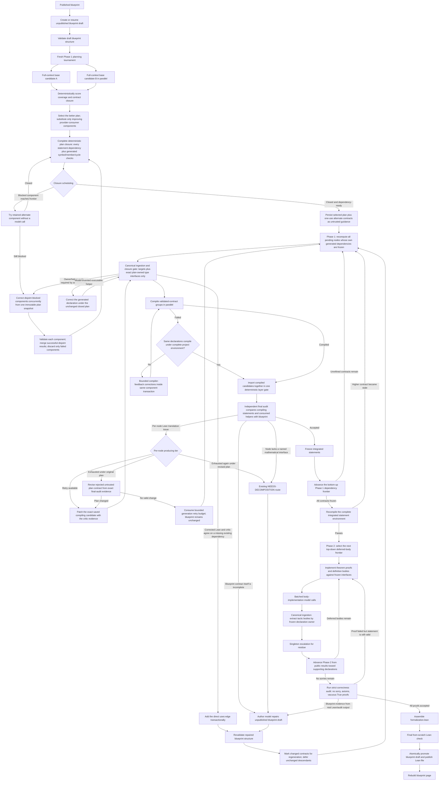
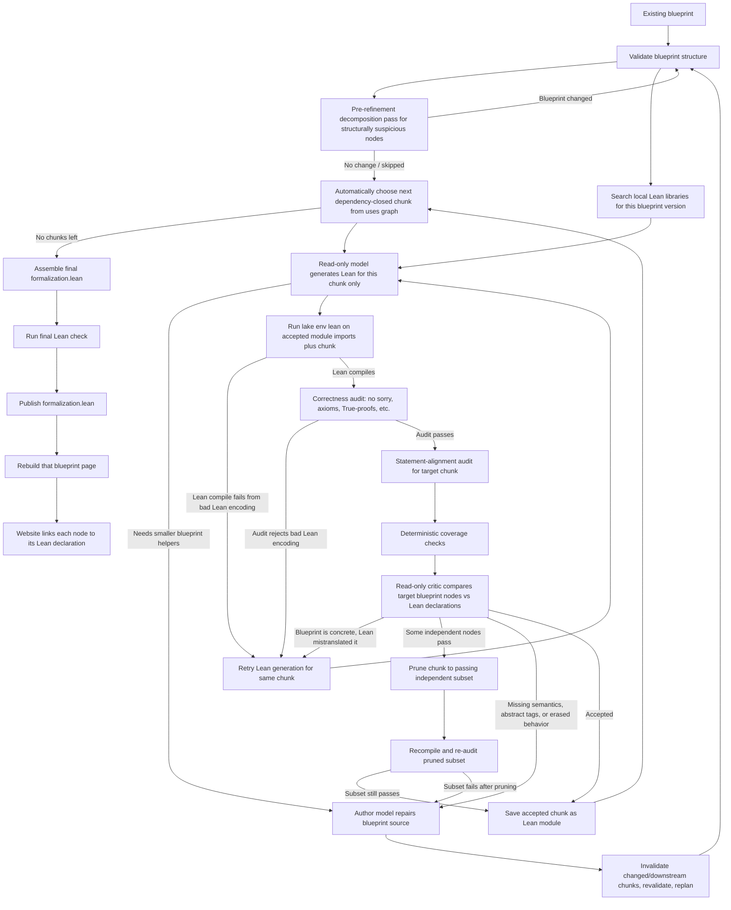

# Auto-Blueprint

Auto-Blueprint turns research papers into leanblueprint-style mathematical
blueprints and publishes them as a static site.

The repository has three layers:

1. **Generation**: `scripts/generate_blueprint.py` uses a selected model runner
   to turn a paper into `blueprints/<name>/`.
2. **Validation**: `scripts/validate_blueprint.py` checks generated blueprint
   structure deterministically before publishing.
3. **Build/deploy**: `scripts/build.py` renders validated blueprints into
   `site/`; GitHub Actions deploys `site/` to Cloudflare Pages.

## Install Locally

Use `uv`:

```bash
cd /Users/rafaelcastro/Downloads/Auto-Blueprint
uv venv --python 3.13
uv pip install -r requirements.txt
```

The web build also needs Graphviz and a LaTeX install locally. CI installs these
automatically.

Lean is not a Python package, so it is not installed by `requirements.txt`.
Auto-Blueprint declares Lean separately with:

```text
lean-toolchain
lakefile.lean
```

To install the repo-pinned Lean/Lake/Mathlib setup locally, run:

```bash
uv run python scripts/setup_lean.py --install-elan
```

That installs `elan` if needed, then runs `lake update` and downloads the
Mathlib cache for this repository.

## Web UI

Everything below can also be driven from a local browser dashboard instead of
the command line:

```bash
uv run python scripts/webui.py
```

That serves `http://127.0.0.1:8321` (use `--port` to change it, `--no-open` to
skip opening the browser) and provides:

- a **Generate** tab: paper path/URL or drag-and-drop PDF upload, blueprint
  name, runner/model pickers, and the `--force` / `--no-build` flags;
- a **Refine with Lean** tab wrapping `scripts/refine_blueprint_with_lean.py`,
  with blueprint picker, max trials, and optional paper context;
- **Validate** and **Build site** tabs wrapping the corresponding scripts;
- a live log console streaming the running script's output, with a Stop button;
- a blueprint list with links to the rendered pages, served from `site/`.

The UI shells out to the same scripts documented below with the same flags, so
behavior is identical to the command line. It runs one job at a time, binds to
localhost only, and needs no extra dependencies.

## Build Existing Blueprints

Build everything:

```bash
uv run python scripts/build.py --strict
```

Build one blueprint:

```bash
uv run python scripts/build.py batch-codes
```

The build runs the validator before rendering each blueprint.

## Generate A New Blueprint

The entrypoint is:

```bash
uv run python scripts/generate_blueprint.py <paper> --name <blueprint-name> --runner <runner>
```

`<paper>` may be:

- a text/LaTeX file;
- a PDF file, if `pdftotext` is installed locally;
- a URL to text/HTML;
- a URL to a PDF, if `pdftotext` is installed locally;
- pasted paper text.

The generated blueprint appears under:

```text
blueprints/<blueprint-name>/
```

Then `scripts/build.py` renders it into:

```text
site/<blueprint-name>/
```

## Two Generation Modes

Auto-Blueprint supports two model modes.

### Mode 1: Agent Mode

Agent mode uses a local coding agent CLI, such as Codex CLI or Claude Code.

Examples:

```bash
uv run python scripts/generate_blueprint.py papers/foo.pdf \
  --name foo \
  --runner codex
```

```bash
uv run python scripts/generate_blueprint.py papers/foo.pdf \
  --name foo \
  --runner claude-code
```

By default, `--runner codex` uses whatever model your Codex app/CLI is already
configured to use. On this machine, that is currently `gpt-5.5`, which is the
CLI model name behind the UI label "GPT-5.5".

With a specific Codex model:

```bash
uv run python scripts/generate_blueprint.py papers/foo.pdf \
  --name foo \
  --runner codex:gpt-5.5
```

Set Codex reasoning effort for harder papers:

```bash
uv run python scripts/generate_blueprint.py papers/foo.pdf \
  --name foo \
  --runner codex:gpt-5.5 \
  --reasoning-effort high
```

Do not use `codex:gpt-5-codex` unless your Codex account explicitly supports
that exact model. For a ChatGPT-backed Codex app, `gpt-5.5` is the model string
shown by your local Codex config.

Supported reasoning values are:

```text
low
medium
high
xhigh
```

Internally this passes Codex:

```text
-c model_reasoning_effort="high"
```

```bash
uv run python scripts/generate_blueprint.py papers/foo.pdf \
  --name foo \
  --runner claude-code:opus
```

Agent mode works like the original `.claude/skills/paper-to-blueprint` workflow:

1. The runner receives the paper plus the paper-to-blueprint instructions.
2. The runner may inspect and edit the repo.
3. The runner runs `scripts/new_blueprint.py`.
4. The runner writes `content.tex`, `web.tex`, and `print.tex`.
5. The runner runs `scripts/validate_blueprint.py <name>`.
6. The runner runs `scripts/build.py <name>`.
7. The runner reports what it created.

Use agent mode when you want the model to behave like a coding collaborator
inside the repository. It is flexible and can recover from build errors, but it
also means the model is allowed to edit files directly.

### Mode 2: API Mode

API mode uses a model API. The model does **not** edit files. It returns a JSON
object, and Auto-Blueprint writes files itself.

OpenAI:

```bash
export OPENAI_API_KEY="..."

uv run python scripts/generate_blueprint.py papers/foo.txt \
  --name foo \
  --runner openai:gpt-5
```

Anthropic:

```bash
export ANTHROPIC_API_KEY="..."

uv run python scripts/generate_blueprint.py papers/foo.txt \
  --name foo \
  --runner anthropic:claude-sonnet-4-5
```

API mode asks the model for JSON shaped like:

```json
{
  "name": "foo",
  "title": "Paper Title",
  "authors": "Paper Authors",
  "description": "One-line landing page summary",
  "home": "https://arxiv.org/abs/...",
  "github": "",
  "build_pdf": false,
  "content_tex": "\\chapter{Introduction}\\n..."
}
```

Then Auto-Blueprint:

1. creates `blueprints/<name>/` from `templates/blueprint-skeleton/`;
2. writes `meta.yml`;
3. writes `blueprint/src/content.tex`;
4. updates `web.tex` and `print.tex` title/author fields;
5. runs `scripts/validate_blueprint.py <name>`;
6. runs `scripts/build.py <name>` unless `--no-build` is passed.

Use API mode for a production-style pipeline: model output is data, and local
code decides what files are written.

### Offline Smoke Test

The mock runner creates a tiny blueprint without calling a real model:

```bash
uv run python scripts/generate_blueprint.py "mock input text long enough to pass the length check ..." \
  --name mock-paper \
  --runner mock \
  --force \
  --no-build
```

Then validate it:

```bash
uv run python scripts/validate_blueprint.py mock-paper
```

## Validator

`scripts/validate_blueprint.py` is the deterministic gate between model output
and publishing.

It checks:

- blueprint source files exist;
- `meta.yml` name matches the folder;
- theorem-like environments have labels;
- labels are unique;
- every `\uses{...}` points to an existing label;
- the dependency graph has no cycles;
- `\input` / `\include` can split content across local `.tex` files, but
  generated LaTeX cannot read files outside that blueprint's `src/` folder;
- `\mathlibok` without `\lean{...}` is reported as a warning.

Validation is not mathematical proof checking. It is a structural safety and
quality gate for generated blueprints.

## Lean Formalization (statements-first, recommended)

After a blueprint exists, the recommended way to formalize it is the
statements-first pipeline:

```bash
uv run python scripts/formalize_blueprint.py my-paper \
  --paper /path/to/paper.pdf \
  --runner codex \
  --workers 3
```

The blueprint is still the only source of truth and Lean is still the critic;
this pipeline changes *when* model calls happen and how much each one does, so
a 150-node paper takes tens of model calls instead of hundreds:

Blueprint repair is transactional. The published source under
`blueprints/<name>/` is copied to
`.auto-blueprint/formalization/<name>/blueprint-draft/`, and every model repair,
structural validation, statement audit, and Lean generation reads that
unpublished draft. A stopped or exhausted run leaves the published blueprint
unchanged. `--continue` resumes both the draft and compatible generated Lean
state; `--fresh` discards both and starts from the published blueprint. Only a
complete final Lean check and correctness audit atomically promote the draft's
`content.tex` into the published blueprint.

Every model-produced Lean response first crosses one canonical ingestion
boundary. Models provide declaration content, but the pipeline owns the module:
it extracts declarations, removes balanced response-only namespace/section
wrappers, allowlists imports and preamble commands, normalizes every
theorem-like blueprint node to Lean's `theorem` command, rejects duplicate
declaration names, and builds a declaration-reference graph for local helpers.
A helper required by the accepted interface plan is deterministically matched
to that plan entry by its contract name, or by a unique kind/member surface,
and receives the plan's canonical owner and name. This remains authoritative
while target bodies are `sorry`, when references cannot reveal ownership.
Phase 1 accepts only blueprint targets and the exact plan-owned
`structure`/`inductive`/`class` interfaces. An extra helper
`def`, theorem, lemma, abbreviation, or instance is rejected before Lean is
run. If the accepted plan requested an invalid declaration surface, the plan
is corrected; if statement generation invented the helper despite a closed
plan, the generated declaration is corrected without paying for another plan
call. Phase 1 must never spend time implementing a body that belongs to Phase
2. A definition-like target normally keeps a terminal `:= sorry`, but a target
whose entire contract is a type may be a transparent alias to its own
plan-owned `structure`, `inductive`, or `class`. This narrow alias contains no
Phase 2 implementation work; it only exposes the structural interface through
the canonical blueprint declaration. Every other completed `def` body remains
invalid in Phase 1. Only the reconstructed canonical
module may be saved, merged, compiled, or used as repair evidence. The same
boundary is used by Phase 1 generation and patches, timeout/refusal salvage,
and Phase 2 body
implementation responses. Consequently, formatting mistakes cannot be persisted and later
charged to an unrelated blueprint node.

Traversal is fixed by phase. Phase 1 freezes statement contracts bottom-up,
from dependencies toward public results. Phase 2 implements bodies top-down,
from public results toward their supporting declarations. There is no traversal
setting because these directions are part of the pipeline design. `--workers`
controls parallel Phase 2 calls and concurrent Phase 1 compilation and
correction of independent groups on a dynamically recomputed dependency-ready
frontier. A failing contract blocks only its actual descendants, never an
unrelated branch that happened to share its original topological depth.

Before Phase 1 starts, one shared root-first planning stage fixes the intended
Lean contract vocabulary across the pending graph. This is not a traversal and
does not generate declarations or proofs; Phase 1 still compiles dependency
contracts first. On a fresh multi-node plan, the base runner generates two
independent full-context candidates concurrently. Both use the same compact
JSON schema and prompt; planning is not made more elaborate. Deterministic
coverage and contract-closure checks score both complete plans. The pipeline
starts from the better global candidate, then tests replacing only its rejected
provider-consumer components with the corresponding component from the other
candidate. A replacement is retained only when rescoring the complete merged
plan shows a strict mechanical improvement. This avoids unsafe node-by-node
mixing while reducing dependence on one nondeterministic planner response.
The non-selected contract for each node is retained as a one-use fallback.
Selective replanning after a blueprint change remains a single call; the
two-candidate tournament is not repeated for every later repair. Graphs above
120 pending nodes still use a small number of bounded calls per candidate
rather than one oversized prompt.
The planner has a JSON-only output contract separate from Lean generation. A
successful-status response with zero usable contracts is rejected and retried
once with explicit completeness feedback inside the same planning transaction;
an empty plan is never accepted or retried with an identical prompt.
The plan prevents each local generation batch from independently redesigning
the same interfaces, but the plan itself is only untrusted generation guidance.
It does not receive a separate model audit: measurements showed that auditing
and correcting a proposal before Lean existed duplicated the authoritative
statement audit and added several minutes. Plan entries are stored per
blueprint node as structured contracts containing the target signature,
declaration-only auxiliary type interfaces, and semantic/interface decisions,
all tied to that node's statement fingerprint. Plan-owned helpers are limited
to `structure`, `inductive`, and `class` interfaces whose fields or
constructors include complete Lean-ish types. A list containing only member
names is rejected before generation, so the statement writer never has to
invent a helper's interface. The plan cannot create helper definitions or
theorems: Phase 2 implements blueprint targets, so such helpers would otherwise
force proof work into Phase 1 or leave an untracked placeholder. Equations and
properties stay on the target contract and its Phase-2 decisions. Statement-level
`\uses` and proof-level `\uses` remain separate: only the former constrain the
Phase 1 public signature, while their union still drives traversal and Phase 2.
Dependency authorization is therefore deterministic rather than a critic-model
judgment. Before generation, a deterministic contract-closure gate builds the
complete planned symbol/member table. For each node it resolves every direct
statement-level dependency to its canonical generated declaration or settled
Mathlib name, then checks the parsed target declaration and every typed helper
field or constructor. One finding reports the complete missing dependency set;
proof-only dependencies and plan prose do not count. The same gate rejects a
generated dotted reference such as `A.member` when the planned declaration `A`
exposes no `member`, use of a helper whose owning node is outside the consumer's
statement dependency closure, generated target dependencies outside that same
closure, a generated alias for a `\mathlibok` node instead of that node's
settled `\lean{...}` name (including aliases inside plan-owned helper member
types), target/helper declaration cycles, and a target signature that declares
anything other than the node's single canonical public Lean target.
When one blueprint node defines several related operations, its
plan must expose them through one plan-owned type interface returned by that
canonical target; it cannot create additional public targets that Phase 2 does
not own. Valid closure results are cached by plan fingerprint and add no model
call. Closure is not a global generation barrier: dependency-ready contracts
outside an invalid component proceed immediately. A missing-member finding
blocks both its consumer and the provider that owns the referenced surface, so
the provider cannot freeze before the inconsistency is repaired. When that
component reaches the traversal frontier, the provider and all connected
rejected consumers first try the retained alternate component with no model
call. The complete plan is rescored, and the substitution is used only if it
strictly improves an unclosed plan (or remains mechanically closed when the
trigger was the later semantic statement audit). If the alternate does not
work, all disjoint blocked components receive one targeted base-model
correction concurrently, bounded by `--workers`. Every call starts from the
same immutable selected-plan snapshot and receives its complete exact findings.
Each result is parsed and mechanically rescored independently; successful
components merge deterministically before one global closure rescore. A failed
component discards only itself for bounded replanning and cannot roll back a
successful sibling. Unrelated contracts and accepted work remain intact, and
an unchanged correction-cache hit cannot consume the retry budget in a no-work
loop. A completely closed plan adds no correction call.
Because a plan-shape rejection contains no evidence about model-call capacity,
it never shrinks the statement section size or quarantines the affected node;
only an actual generation timeout or failure may train that scheduler.
The same lossless object is then persisted and passed to generation. Before
compilation, the deterministic handoff gate rejects any candidate that omits a
target/helper promised by its contract or materializes a cycle between a
target and its plan-owned type helper. Such cycles also return to targeted plan
correction rather than compiler patching. Correctness is decided only on the
generated Lean: it must compile and the independent statement critic must
accept the actual declaration together with its consumed helpers. A
model that emits `target.Helper` for a planned `Helper` does not trigger a
repair call merely because of that spelling: canonical ingestion maps it to
the exact plan-owned helper, and all later slicing, diagnostics, and audits use
the same ownership map. A blueprint repair therefore replans only changed
entries, while unchanged entries survive later waves and `--continue`.
Generation prompts receive only the contracts for their targets, direct
dependencies, and direct consumers rather than the full graph-wide plan.

1. **Phase 1 — statements and interfaces bottom-up.** Phase 1 starts at
   dependency leaves and creates exact audited sections directly, climbing
   toward consumers without provisional whole-graph declarations. Every
   frontier begins with a statement-generation transaction. Statement-generation
   and correction prompts contain
   only the exact generated interfaces required by their direct dependencies,
   plus the generated names referenced by those interfaces. A deterministic
   name-set check prevents dispatch if that compact context is incomplete;
   unrelated frozen modules are not copied into the prompt.

   Bottom-up Phase 1 uses a validated-contract transaction over a dynamic ready
   frontier. After every accepted transaction, readiness is recomputed from the
   actual frozen contracts. The scheduler never requires an entire static graph
   layer to finish: unresolved nodes remain queued and block only consumers in
   their own dependency closure. Candidate groups
   are generated concurrently from the shared untrusted interface plan
   and pass canonical ingestion plus deterministic coverage and dependency
   checks in memory. If one concurrent group fails those checks, every sibling
   that passed continues immediately through compilation, integration, and the
   statement audit; accepted siblings freeze in the same attempt and are also
   persisted for crash safety. Only failed or subsequently rejected groups remain
   queued for the next dynamically recomputed frontier. Successful candidate
   groups are compiled in parallel. An incomplete model response does not make
   its complete siblings disappear: independently owned returned declarations
   pass the same deterministic gates and are persisted as reusable uncompiled
   candidates, while only the missing or invalid declarations are routed for
   another model call. Reusable singleton/components are scheduled separately
   from fresh work so batching cannot accidentally regenerate them. If several
   parallel groups fail, the transaction retains every candidate, exact error,
   and retry route; auditing a successful sibling cannot mask those failures.
   Independently authorized repair actions are aggregated as well: deterministic
   dependency edges are applied without dropping simultaneous blueprint or
   decomposition repairs, and accepted sibling contracts remain frozen.
   Before asking a model to rewrite a failing
   candidate, the pipeline tests the identical declarations under the complete
   Mathlib environment; a
   candidate that passes is retained unchanged with that environment. Before
   compilation, a closure gate rejects executable local helpers not represented
   by blueprint nodes; only exact plan-owned type interfaces may accompany a
   target. This prevents outline generation from turning into untracked proof
   or implementation work. Real
   declaration errors receive up to three
   bounded compiler-feedback corrections inside the same candidate transaction,
   so they do not restart generation or repeat an already completed contract-plan
   audit. The compiled candidates are imported together, then one independent
   final statement audit compares the actual compiling declarations with the
   blueprint. Its cache key includes every target and every transitively consumed
   local helper. No candidate counts as frozen until compilation, integration,
   and this final audit pass. Top-down Phase
   1 retains its group transaction because it refines declarations inside the
   provisional whole-graph environment, but it uses the same deterministic,
   Lean, semantic, retry, and repair gates.

   Audit batching
   never merges retry history: every node retains the model tier that produced
   its candidate, its statement fingerprint, failure count, and rejection
   evidence. The critic classifies each rejected node independently, so one
   batched verdict may send a missing mathematical interface to blueprint
   decomposition while an unrelated Lean translation error keeps its saved
   candidate and retry lifecycle. This routing reuses the audit call already
   required for publication; it adds no classifier/model call. A rejected
   base-tier statement is isolated and its next attempt
   starts at the escalation tier even when several independent candidates were
   audited together. If that exact statement version is rejected again after
   escalation, it cannot silently restart under the same rejected plan. The
   final critic's exact evidence first patches the saved compiling candidate,
   then recompiles and re-audits only that contract. If both model tiers reject
   the same contract, the evidence revises only that node's untrusted interface
   plan; the compiling candidate is retained as the revision seed and rebound
   to the corrected plan rather than deleted. If the same statement then
   exhausts both model tiers again under that evidence-revised plan, Phase 1
   routes only that node to the existing decomposition transaction. This means
   the blueprint must expose the missing named object, operation, relation, or
   substantial intermediate statement before Lean translation resumes; it does
   not permit weakening the claim. If no valid plan revision or decomposition
   evidence exists, the failure consumes the bounded generation-retry budget
   without editing the blueprint. Translation exhaustion by itself is never
   mathematical evidence. Acceptance or a
   blueprint statement change clears the lifecycle. Evidence that
   a layer is only partially rejected does not discard its accepted siblings:
   before compilation they remain in-memory candidates; after compiler-driven
   changes, accepted declarations are extracted into a smaller module and pass
   deterministic checks and Lean compilation again before they are retained.
   Extraction failure falls back to regeneration of only that affected group.
   Deterministic audit failures use the same narrow transaction boundary. When
   every finding is attributable to a proper subset of a generated section,
   the unaffected declarations are extracted and independently rechecked, and
   only the rejected statement versions are regenerated. A genuinely
   file-level finding, or a failure covering the entire section, keeps the
   whole-section retry because no smaller ownership claim is justified.
   Lean-generation retry scope is selected by one provider-neutral policy used
   in both phases: an attributable proper subset is isolated, an unresolved
   multi-node unit is bisected, and only a singleton may reach the configured
   escalation runner. When a batched audit contains multiple independently
   generated failures, its verdict is mapped back to those original singleton
   units instead of treating the audit batch as a new indivisible failure.
   A rejected declaration is retained as a statement-and-plan-fingerprinted
   revision candidate. Every generation, deterministic patch, compiler patch,
   timeout salvage, and semantic correction is canonicalized and evaluated by
   the complete deterministic Phase 1 gate before it can replace that retained
   code. A replacement is installed only when it introduces no new
   deterministic violation and removes at least one old violation. A Lean
   correction may also advance when it reduces compiler errors or compiles; a
   semantic correction may advance with the same deterministic obligations,
   but it still has to compile and pass the independent statement critic before
   freezing. Deterministically regressing proposals are recorded as evidence
   while the previous best remains the rollback candidate. A compiler patch
   that preserves every deterministic obligation but has not yet reduced the
   Lean error count is retained in a separate working transaction: the next
   compiler correction edits that exact intermediate instead of restarting
   from the old error. It is not accepted or frozen, and it replaces the best
   candidate only after measurable progress or successful compilation. If a
   semantic correction conflicts with a plan-owned interface, the exact
   finding revises that plan entry rather than repeatedly regenerating Lean
   under the unchanged contract.

   The retained state includes the exact deterministic obligation set, Lean
   output, semantic rejection, model-tier provenance, and attempted retry
   tiers. The next model call therefore receives the current deterministic-clean
   compiler transaction when one exists, otherwise the best exact Lean
   declaration, together with cumulative compiler/critic evidence instead of
   recreating it from an empty file. Candidate text is runner-independent and survives
   `--continue`. A blueprint statement edit or interface-plan edit starts a new
   fingerprint epoch; accepted siblings remain untouched. `--fresh` discards
   the state. Every candidate remains untrusted and passes the normal
   deterministic, Lean, integration, and semantic-audit gates before
   publication.
   The statement critic may also name an existing blueprint label whose public
   declaration is required by the corrected contract but absent from the
   node's `\uses{...}` closure. That report alone cannot edit the graph. If the
   corrected Lean then references the same generated declaration and the
   deterministic closure gate rejects that exact reference, the pipeline adds
   the direct `\uses` edge transactionally, validates the complete draft, and
   invalidates only the affected fingerprints and descendants. This avoids
   repeatedly rewriting an otherwise faithful statement under a graph contract
   that makes it impossible to accept. A proposed edge is checked against the
   current dependency graph before any file is edited. If it would close a
   cycle, the edge is rejected with the exact existing dependency path and that
   evidence enters the ordinary bounded blueprint-repair transaction.
   Explicit blueprint-repair and confirmed-decomposition classifications bypass
   this scope policy unchanged.
   Evidence that
   the blueprint contract itself is inadequate routes to
   the bounded blueprint-repair path. After lower contracts settle, recompile
   the integrated environment so higher contracts cannot retain stale
   interfaces. Phase 2 may replace terminal `sorry` bodies, but it cannot
   silently reshape a frozen statement.

   Every blueprint environment kind outside the definition-like set (including
   custom `\newtheorem` environments such as `claim` or `corollary`) is emitted
   using Lean's `theorem` command and keeps a terminal `:= sorry` until Phase 2.
   Definition-like nodes freeze an exact typed `def`/`abbrev` header with a
   deferred terminal body; structural type contracts may instead freeze as a
   transparent canonical alias to their exact plan-owned structure, inductive,
   or class interface. Those interfaces freeze their fields or constructors
   immediately.
   Model output that spells a declaration as `corollary` is normalized to
   `theorem` before coverage or compilation, rather than being mistaken for a
   missing declaration. Resumed sessions are discarded between
   independent generation chunks; local correction calls may resume their own
   producer session. Repeated byte-identical exchanges are detected before the
   pipeline pays to compile and request them again.
   Phase 1 blueprint repairs are also scope-checked deterministically: a repair
   may change the failing node and helper/dependency contracts needed by that
   node. When decomposition adds a new property/helper node, the rejected target
   must depend on that helper, directly or transitively. A helper that instead
   depends on the target is rejected before the draft is accepted because it
   cannot support the target and commonly leads to a later cycle. Existing
   downstream consumer contracts are still rolled back and retried with narrower
   instructions. Consumers are rechecked against the repaired interface instead
   of being rewritten preemptively. The statement auditor can return
   `needs_decomposition` with exact missing helper statements. On the first such
   verdict for an otherwise untried plan, Phase 1 revises only that plan entry
   with the exact audit evidence and retries statement generation. A repeated
   decomposition verdict under the revised plan routes through the existing
   `NEEDS-DECOMPOSITION` blueprint transaction. This avoids mutating the
   blueprint for an interface-planning mistake while still decomposing a claim
   when the evidence persists.
   Section capacity adapts from observed latency rather than mathematical
   guesses. A genuine batch timeout reduces later batch size; two complete
   batches accepted at the current capacity grow it back exponentially, up to
   `--section-size`. An unattributed non-timeout failure is bisected only within
   that exact statement-fingerprinted group; it does not reduce the capacity of
   unrelated frontiers. The resulting local parts persist across `--continue`
   and expire when one of their statements changes or the part freezes. Routed
   singletons and short tail sections do not count as evidence that a broad
   batch is safe. A `NEEDS-DECOMPOSITION` response or
   repeated normalized Lean failure naming one node quarantines that exact
   statement version as a singleton until it freezes. Each quarantine record
   stores the statement fingerprint and observed failure class. A blueprint
   repair that changes the statement automatically releases the old record, so
   `--continue` cannot permanently degrade later sections into one-node
   generation/audit calls. Unchanged failing statements remain isolated.
   Quarantine, local bisection parts, retry lifecycle, rejected revision
   candidates, and capacity are saved to
   `skeleton_state.json` immediately
   when they change — and after every frozen part of a split section — so a
   killed or quota-limited run resumes with everything it learned; legacy
   label-only quarantine is discarded because it cannot be matched safely to a
   statement version. Successful critic verdicts are cached by the exact
   blueprint-text/Lean-statement fingerprint for the current run. Regrouping an
   unchanged declaration after a sibling fails therefore cannot trigger another
   paid audit. Compiler and audit evidence that crosses the outer Phase-1 loop
   is persisted per statement fingerprint and inserted into the next generation
   prompt. It is cleared only when that statement is accepted, and is discarded
   automatically if blueprint repair changes the statement. Thus an unchanged
   retry cannot silently receive the same prompt that already failed. Every prompt
   also receives an authoritative dependency table distinguishing generated
   declarations from `\mathlibok` declarations and their settled Lean names.
   Prompts are dependency-sliced so their size scales with the work in the
   call, not with blueprint size: library candidates are filtered to the
   targets' own search terms, the node-graph orientation covers only targets
   plus direct dependencies and consumers, and frozen-interface digests keep
   direct-dependency modules under budget pressure. Read-only generation and
   audit calls run with agent-spawning and harness-side tools disabled, and
   every generation prompt carries a write-discipline rule: spend at most
   half the budget exploring, and always emit the requested code.
2. **Phase 2 — bodies and proofs top-down.** Phase 1
   freezes exact declaration headers/interfaces but leaves both theorem proofs
   and typed `def`/`abbrev` bodies as terminal `sorry`. Phase 2 implements every
   deferred body from public results toward supporting declarations, regardless
   of the Phase 1 statement order. A higher theorem is accepted against the
   exact frozen statements of its dependencies; replacing those dependencies'
   theorem bodies later does not change that interface or discard the accepted
   higher proof. Completed definition
   bodies receive a read-only semantic audit against their blueprint nodes;
   compilation alone cannot accept a definition with the right type but wrong
   meaning. Structure fields and inductive constructors remain Phase-1
   interfaces because they have no separate body to fill.
   Lower-frontier prompts include the frozen statements and blueprint proof
   contracts of the higher results that consume them, so information flows
   downward without inventing a second graph or creating Lean import cycles.
   At each frontier a deterministic tactic ladder
   (`rfl`/`omega`/`norm_num`/`ring`/`simp`/`aesop`) runs first at zero model
   cost; survivors use batched calls in parallel across owning sections, and
   only the residue escalates to singleton calls. Independent nodes in the
   current root-first frontier may run in parallel according to `--workers`.
   Phase 2 uses the same failure-scope policy as Phase 1: successful bodies stay
   committed, a failed subset is retried alone, and a batch that fails as a
   whole is repeatedly bisected through base-runner rounds before any remaining
   singleton is sent to the escalation runner.
3. **Repair — evidence only.** A timed-out model call is treated as latency,
   never as mathematical difficulty: batches are bisected, targeted declaration
   patches are used for small skeleton failures, and singletons are retried at
   higher effort. A base-model skeleton `NEEDS-DECOMPOSITION` response is
   treated as a generator claim, not immediate repair evidence: Phase 1 first
   retries the same section through the escalation runner using the existing
   targets and plan-owned type interfaces (and any declarations delivered
   alongside the refusal are reused for the other nodes). It cannot invent
   executable top-level helpers; a genuinely missing mathematical helper must
   become a blueprint node through decomposition. Blueprint repair
   calls whose target still contains multiple labels are also split on timeout
   instead of treating latency as mathematical evidence. Repair prompts are
   dependency-sliced: an agent-mode repair receives the failing nodes, their
   dependency-closure statements, immediate consumers, a deterministic paper
   excerpt, and the harness conventions, and reads `content.tex` from disk
   instead of receiving the whole blueprint inline. Repairs are instructed to
   stay additive — add helper nodes and keep non-target statements unchanged.
   A model audit cannot authorize blueprint mutation merely by returning the
   label `blueprint_issue`: it must identify the exact mathematical information
   absent from the blueprint. If the existing text is concrete and another
   Lean representation could encode it faithfully, the failure stays a Lean
   translation retry. This prevents witness-sensitive structures, unsuitable
   equality choices, and similar encoding mistakes from expanding an otherwise
   valid blueprint. Only real Lean/audit output, an escalated
   `NEEDS-DECOMPOSITION` refusal, or a statement that cannot even be *stated*
   within two full escalated budgets can trigger a blueprint repair (bounded
   by `--max-trials`, default 100). If the same Phase-1 section keeps returning
   to repair after ordinary skeleton fixes, the pipeline performs one
   constrained section-normalization pass. Its editable scope is the exact set
   of evidence-backed failing contracts plus immediate helper nodes; rejected
   siblings that have not exhausted their own retry lifecycle are context only
   and retain their current retry tier. Partially overlapping failure sets are
   tracked independently rather than unioned into a wider edit scope. The
   result is validated and rejected/rolled back if it changes unauthorized or
   too many node contracts. A
   timeout, malformed model response, invalid edit, or rejected normalization
   is rolled back and becomes a bounded no-op/fallback repair; it does not kill
   the run. The formalization loop stops deliberately only when the configured
   blueprint-repair budget is exhausted. A changed node is detected with the
   full per-node blueprint contract, including its proof sketch. That node is
   regenerated. Descendants whose own contracts did not change are retained as
   deferred, untrusted cache candidates: their old `.olean` is deleted, their
   generated imports are rebound to the repaired modules, and Lean recompiles
   them locally. Reactivation is attempted eagerly after every frozen section,
   not only between waves, so a chain of deferred sections recovers as soon as
   its dependencies refreeze. A descendant is reactivated only if that
   deterministic check passes; otherwise it returns to Phase 1 refinement.
   Thus proof-prose edits
   cannot silently retain stale Lean, while an interface repair does not force
   model regeneration of every unchanged consumer. Repair telemetry records
   graph distance, added/removed helpers, deferred descendants, deterministic
   recheck outcomes, and the smaller set that really required regeneration. A
   repair that changes a contract with no path to any requested target in the
   union of the old and new `\uses` graphs is rolled back; genuinely necessary
   helper or consumer edits remain allowed by adding their explicit graph edge.

The published contract is unchanged: `formalization.lean` contains no
`sorry`, passes the strict correctness audit, is recompiled from scratch as a
final gate, and every declaration corresponds 1-1 to a blueprint node.
`sorry` exists only inside the internal scratch skeleton under
`AutoBlueprint/Generated/<Name>/SkeletonNN.lean`, which is never published.

Every dependency contract is still enforced: a node whose blueprint entry
`\uses{...}` another node must visibly use that node's generated Lean name.
It is checked in the frozen interface whenever the dependency belongs there,
and again in every completed declaration body. An implementation that silently
re-derives a declared dependency inline is rejected.

Useful flags: `--section-size` (statements per Phase-1 call, default 24),
`--proof-batch-size` (deferred bodies per Phase-2 call, default 12), `--workers`
(parallel Phase-2 implementation workers plus bottom-up Phase-1 routed-fragment
workers, default 3), `--runner` (base
runner/model for batched calls; when omitted, the CLI uses the same
cheap-API-first preset as the Web
UI), `--reasoning-effort` (codex effort for batched calls, default `medium`),
`--escalation-runner` (runner/model for singleton retries and blueprint repair;
when `--runner` is explicitly set, the CLI default is the same runner, otherwise
it uses the stronger half of the auto preset),
`--escalation-effort` (codex effort for escalation calls, default `high`),
`--timeout`/`--hard-timeout` (per-call budgets, defaults 300/600 s),
`--no-ladder`, `--no-build`, `--continue`, and `--fresh`. For non-Codex runners,
`--reasoning-effort`/`--escalation-effort` do not change model strength; use
different `--runner` and `--escalation-runner` model specs instead.
Continuation is the default. `--continue` states it explicitly; `--fresh` is
required to discard the unpublished blueprint draft and generated
fast-pipeline state. Continuation reloads
`skeleton_state.json`, keeps every section whose file hash, blueprint statement
fingerprints, and full proof-contract fingerprints still match. Unchanged
descendants of a stale dependency are loaded as deferred cache candidates and
must recompile against the regenerated dependency before becoming frozen again.
It also restores statement-fingerprinted quarantine records and the measured
Phase-1 capacity. Quarantine is reused only when the saved statement hash still
matches; a repaired statement is scheduled normally and can rejoin a batched
generation and audit section.

The Web UI **Refine with Lean** tab runs this pipeline by default. Its preset
is intentionally two-tiered:

- If `OPENAI_API_KEY` is set, the UI/CLI calls OpenAI's `GET /v1/models`,
  fills the dropdown from the returned model IDs, and chooses a base model from
  the live list using cheap-tier class markers such as `mini`/`nano`; escalation
  is chosen from non-`mini`/`nano` text models in the same live list.
- Else, if `ANTHROPIC_API_KEY` is set, the UI/CLI calls Anthropic's
  `GET /v1/models`, fills the dropdown from the returned model IDs, chooses a
  `haiku`-class base model when available, and chooses a non-`haiku`
  `sonnet`/`opus`-class escalation model when available.
- Else, it falls back to local Codex by reading `codex debug models`, filling
  the dropdown from the returned model slugs, and choosing a lighter base model
  plus a stronger escalation model from that catalog.

The model fields remain editable because provider/account model availability
can differ, and model-list calls can fail offline. Leave a model field blank to
use that runner's default. Uncheck "Fast
statements-first pipeline" to fall back to the legacy loop below.

The explicit OpenAI-style CLI shape, if you want to pin model names yourself,
is:

```bash
uv run python scripts/formalize_blueprint.py subquadratic-transformers \
  --runner openai:gpt-5-mini \
  --escalation-runner openai:gpt-5 \
  --timeout 300 \
  --hard-timeout 600 \
  --workers 3 \
  --continue
```

Fast pipeline diagram:


```mermaid
flowchart TD
    A["Published blueprint"] --> AD["Create or resume unpublished blueprint draft"]
    AD --> B["Validate draft blueprint structure"]
    B --> BP0["Fresh Phase 1 planning tournament"]
    BP0 --> BPA["Full-context base candidate A"]
    BP0 --> BPB["Full-context base candidate B in parallel"]
    BPA --> BPSEL["Deterministically score coverage and contract closure"]
    BPB --> BPSEL
    BPSEL --> BPM["Select the better plan; substitute only improving provider-consumer components"]
    BPM --> BPC["Complete deterministic plan closure: every statement dependency plus generated symbol/member/cycle checks"]
    BPC --> BPS{"Closure scheduling"}
    BPS -->|Closed and dependency-ready| BPG["Persist selected plan plus one-use alternate contracts as untrusted guidance"]
    BPS -->|Blocked component reaches frontier| BPAF["Try retained alternate component without a model call"]
    BPAF -->|Still blocked| BPR["Correct disjoint blocked components concurrently from one immutable plan snapshot"]
    BPAF -->|Closed| BPC
    BPR --> BPMERGE["Validate each component; merge successful disjoint results; discard only failed components"]
    BPMERGE --> BPC
    BPG --> BU["Phase 1: recompute all pending nodes whose own generated dependencies are frozen"]
    BU --> C1["Canonical ingestion and closure gate: targets plus exact plan-owned type interfaces only"]
    C1 -->|Owner/helper cycle required by accepted plan| BPR
    C1 -->|Model-invented executable helper| GRC["Correct the generated declaration under the unchanged closed plan"]
    GRC --> C1
    C1 --> PA["Compile validated-contract groups in parallel"]
    PA -->|Failed| EF{"Same declarations compile under complete project environment?"}
    EF -->|Yes| IG["Keep declarations unchanged with resolved environment"]
    EF -->|No| CP["Bounded compiler-feedback corrections inside same component transaction"]
    CP --> PA
    PA -->|Compiled| IG["Import compiled candidates together in one deterministic layer gate"]
    IG --> CH["Independent final audit compares compiling statements and consumed helpers with blueprint"]
    CH -->|Accepted| I["Freeze integrated statements"]
    CH -->|Per-node Lean translation issue| RT
    RT{"Per-node producing tier"} -->|Retry available| SC["Patch the exact saved compiling candidate with the critic evidence"]
    SC --> C1
    C1 -->|Corrected Lean and critic agree on a missing existing dependency| DER["Add the direct uses edge transactionally"]
    DER --> RV
    RT -->|Exhausted under original plan| PCR["Revise rejected untrusted plan contract from exact final-audit evidence"]
    PCR -->|Plan changed| SC
    PCR -->|No valid change| GB["Consume bounded generation retry budget; blueprint remains unchanged"]
    GB --> BU
    RT -->|Exhausted again under revised plan| ND["Existing NEEDS-DECOMPOSITION route"]
    CH -->|Node lacks a named mathematical interface| ND
    CH -->|Blueprint contract itself is incomplete| R["Author model repairs unpublished blueprint draft"]
    ND --> R
    R --> RV["Revalidate repaired blueprint structure"]
    RV --> RC["Mark changed contracts for regeneration; defer unchanged descendants"]
    RC --> BU
    I --> N1["Advance the bottom-up Phase 1 dependency frontier"]
    N1 -->|Unrefined contracts remain| BU
    N1 -->|All contracts frozen| RR["Recompile the complete integrated statement environment"]
    RR -->|Higher contract became stale| BU
    RR -->|Passes| J["Phase 2: select the next top-down deferred-body frontier"]
    J --> K["Implement theorem proofs and definition bodies against frozen interfaces"]
    K --> L["Batched body-implementation model calls"]
    L --> C2["Canonical ingestion: extract tactic bodies by frozen declaration owner"]
    C2 --> M["Singleton escalation for residue"]
    M --> N["Advance Phase 2 from public results toward supporting declarations"]
    N -->|Deferred bodies remain| K
    N -->|No sorries remain| V["Run strict correctness audit: no sorry, axioms, vacuous True proofs"]
    V -->|Proof failed but statement is still valid| K
    V -->|Blueprint evidence from real Lean/audit output| R
    V -->|All proofs accepted| O["Assemble formalization.lean"]
    O --> P["Final from-scratch Lean check"]
    P --> Q["Atomically promote blueprint draft and publish Lean file"]
    Q --> QB["Rebuild blueprint page"]
```

## Legacy Lean-Guided Refinement (per-chunk loop)

The original per-chunk author/critic loop is still available:

```bash
uv run python scripts/refine_blueprint_with_lean.py my-paper \
  --paper /Users/rafaelcastro/Downloads/pseudo-rand-gen.pdf \
  --runner codex \
  --reasoning-effort high \
  --max-trials 3 \
  --timeout 300 \
  --hard-timeout 600
```

It generates and audits one dependency-closed chunk (usually one node) per
model call, sequentially. It is significantly slower and more call-hungry than
the statements-first pipeline and routes model-call timeouts into blueprint
decomposition; prefer `scripts/formalize_blueprint.py` unless you specifically
want the old behavior.

This loop is intentionally different from “ask the model to hack Lean until it
passes.”

Legacy loop diagram:


```mermaid
flowchart TD
    A["Existing blueprint"] --> B["Validate blueprint structure"]
    B --> BP["Pre-refinement decomposition pass for structurally suspicious nodes"]
    BP -->|Blueprint changed| B
    BP -->|No change / skipped| P["Automatically choose next dependency-closed chunk from uses graph"]
    P -->|No chunks left| Z["Assemble final formalization.lean"]
    Z --> ZC["Run final Lean check"]
    ZC --> L["Publish formalization.lean"]
    B --> S["Search local Lean libraries for this blueprint version"]
    P --> C["Read-only model generates Lean for this chunk only"]
    S --> C
    C -->|Needs smaller blueprint helpers| J
    C --> D["Run lake env lean on accepted module imports plus chunk"]
    D -->|Lean compile fails from bad Lean encoding| E["Retry Lean generation for same chunk"]
    E --> C
    D -->|Lean compiles| F["Correctness audit: no sorry, axioms, True-proofs, etc."]
    F -->|Audit rejects bad Lean encoding| E
    F -->|Audit passes| G["Statement-alignment audit for target chunk"]
    G --> H["Deterministic coverage checks"]
    H --> I["Read-only critic compares target blueprint nodes vs Lean declarations"]
    I -->|Blueprint is concrete, Lean mistranslated it| E
    I -->|Some independent nodes pass| Q["Prune chunk to passing independent subset"]
    Q --> QC["Recompile and re-audit pruned subset"]
    QC -->|Subset still passes| A1
    QC -->|Subset fails after pruning| J
    I -->|Missing semantics, abstract tags, or erased behavior| J["Author model repairs blueprint source"]
    J --> K["Invalidate changed/downstream chunks, revalidate, replan"]
    K --> B
    I -->|Accepted| A1["Save accepted chunk as Lean module"]
    A1 --> P
    L --> M["Rebuild that blueprint page"]
    M --> N["Website links each node to its Lean declaration"]
```

Before chunking starts, the script runs a bounded pre-refinement decomposition
pass unless `--no-pre-decompose` is set. The deterministic prepass selects a
small number of unresolved nodes with formalization-risk signals such as long
proofs, several displayed equations, finite sums/products, reindexing language,
or many equation-like steps. A model may then edit the blueprint to split those
nodes into smaller helper definitions/lemmas. If it changes the blueprint, that
change is validated and counted as one blueprint-repair trial; Lean generation
then starts from the updated blueprint. This does not create a side plan: the
blueprint source is still what Lean must implement one-to-one.

Each chunk loop then does this:

1. validate the current blueprint structure;
2. automatically choose the next dependency-closed chunk from the `\uses{...}`
   graph;
3. search local Lean libraries for this blueprint version;
4. make a read-only model call that sees the whole dependency graph, the target
   node source, relevant unresolved dependency source, accepted Lean signatures,
   local library candidates with declaration snippets, and a small Lean idiom
   sheet, then ask it to generate Lean only for the target chunk. If the model
   determines that a target node cannot be formalized faithfully as one public
   Lean declaration from the current blueprint text, it may return
   `NEEDS-DECOMPOSITION: {...}` instead of weakened Lean; that is routed to
   blueprint repair so the node can be split into explicit helper nodes by the
   refinement loop;
5. save accepted chunks as temporary Lean modules and run `lake env lean` on
   imports of those modules plus the new chunk;
6. if Lean compiles, run correctness and statement-alignment audits for the
   target chunk;
7. if Lean/audit fails because the blueprint is concrete but the Lean
   translation is bad, retry Lean generation for the same chunk;
8. if Lean/audit fails because the blueprint is missing
   mathematical content, is too abstract, lets Lean erase the intended
   behavior, or the Lean generator explicitly requests decomposition, make a
   second model call with the blueprint plus the critic output;
9. require that second call to edit the blueprint, not the Lean file;
10. when a statement audit rejects only part of a chunk, compute the rejected
    nodes' downstream closure inside that chunk; if unrelated nodes remain,
    prune the generated module so it exposes only those unrelated nodes, then
    re-run Lean and the statement audit before keeping that subset;
11. after a blueprint repair, revalidate the whole blueprint and invalidate
    only changed nodes plus downstream nodes that depend on them;
12. if the chunk or a verified independent subset passes, save it as a generated
    Lean module and move to the
    next chunk;
13. when all chunks pass, assemble a standalone `formalization.lean`, run a
    final Lean check, and publish it.

Blueprint decomposition is part of refinement, not a manual preprocessing step.
The checked-in blueprint should not be hand-edited just to pre-split one
paper's hard node. When a node looks too large before Lean generation, the
pre-refinement pass may split it first. When that was not enough, or when a
node only becomes obviously underspecified after generated Lean/audit feedback,
the normal repair path can still split it later from the Lean/audit failure or
`NEEDS-DECOMPOSITION` response.

So a blueprint-content failure has two model phases:

```text
blueprint + current chunk -> model generates Lean -> script runs Lean + audit -> Lean/audit errors
Lean/audit errors + blueprint -> model repairs blueprint
```

The next pass then starts over from the repaired blueprint:

```text
repaired blueprint -> replan chunks -> model generates fresh Lean for the next chunk
```

The loop does not train or update the model. Each author, critic, and Lean
generation step is a fresh model call. Information carries forward only through
the edited blueprint source, accepted Lean modules, the current prompt, and the
failure text explicitly included in that prompt. This means a later call can
repeat a modeling mistake if the previous repair did not make the missing
requirement concrete in the blueprint. The system handles that by rejecting the
weak Lean again and forcing another blueprint repair.

If a blueprint repair produces no parsed node-text changes, the run no longer
keeps blindly spending the same repair shape forever. It first escalates with
explicit instructions, then forces decomposition mode for the stuck node(s), and
if those repair strategies still no-op, it regenerates with the accumulated
audit history until the `--max-trials` budget is exhausted.

Lean and audit errors are therefore still used to repair the blueprint. Chunking
only changes the size of the Lean obligation; the blueprint remains the source
of truth. You do not normally choose a chunk size: the script traverses the
dependency graph from the currently-ready frontier with a deterministic
difficulty-aware scheduler. Straightforward definitions and small lemmas can be
batched, a few medium nodes can share a chunk, and theorem/reduction/hardness
nodes are isolated as singleton chunks. The classifier uses only blueprint
metadata and text features such as node kind, proof size, dependency count, and
keywords like reduction, hardness, runtime, transfer, approximation, tensor,
SETH, and OVC. There is an advanced `--chunk-size` override for experiments,
but it is an upper bound; it does not force hard nodes to be mixed with other
work. The Web UI intentionally hides it.

After a blueprint repair, accepted chunks whose node text did not change are
kept; changed nodes and their downstream dependents are regenerated. A failed
chunk is not always thrown away wholesale: if the audit identifies specific
rejected nodes, the script can keep unrelated nodes from the same chunk, but
only after removing the rejected/downstream public declarations from the module,
recompiling that pruned module, and re-running the statement audit on the kept
subset.

Accepted chunks are cached as generated Lean modules under
`AutoBlueprint/Generated/<BlueprintName>/ChunkNN.lean` during the run. Later
chunks import those modules, and the model sees compact accepted declaration
signatures instead of thousands of lines of prior Lean source. These module
files are scratch cache and ignored by Git. When all chunks pass, the script
assembles a standalone `blueprints/<name>/blueprint/lean/formalization.lean`
for the website and for Git.

The Lean-generation prompt is deliberately scoped. It does not resend the full
TeX source of every blueprint node on every chunk. It sends the global node
graph for orientation, then only the target chunk source plus unresolved
dependency source. Blueprint repair calls still receive the broader blueprint
context because those calls are allowed to edit the blueprint itself.

The local library search is done once per blueprint version/chunk pass, not once
per Lean retry. It searches installed local Lean libraries, currently Mathlib
and any CS Lib checkout found under `.lake/packages/`, for likely
declarations/modules. Candidate modules are found deterministically and shown to
the model with short declaration snippets, so the model should treat those module
paths as already verified instead of reopening Mathlib to check them. If
deterministic search finds too little, the read-only model proposes extra search
terms, then deterministic search runs again. The resulting candidate list is
reused for every Lean-generation retry in that chunk.

`--timeout` is the base wall-clock budget for each non-deterministic model
call made by the refinement loop. It is not a whole-run timeout and it does not
control deterministic Lean compilation checks, which have their own fixed
timeouts. The default is 300 seconds so ordinary chunks cannot silently spend
10-20 minutes in a single model call. `--hard-timeout` is the per-call budget
used when the scheduler classifies the current target chunk as hard; it must be
at least `--timeout` and defaults to 600 seconds. The Web UI exposes both
fields in the **Refine with Lean** tab. If a model call hits its budget, the
runner reports a timeout and the refinement loop handles that as a failed model
attempt or, when appropriate, escalates to blueprint repair/decomposition.
Timeouts before any Lean code is returned are handled specially because retrying
the same oversized prompt usually just wastes another full timeout window. If a
multi-node chunk times out, the scheduler immediately replans those labels as
singleton chunks and uses the hard-node timeout for them. If a singleton chunk
times out at the base timeout, the scheduler first reclassifies that node as
hard and retries it with `--hard-timeout`. Only if a singleton chunk times out
again with the hard-node timeout does the run treat that as evidence that the
blueprint node may be too large or underspecified to formalize faithfully as one
declaration and route it to blueprint decomposition. Timeout routing hints are
stored under `.auto-blueprint/formalization/<name>/routing_hints.json`, so a
later `--continue` run does not have to rediscover the same timeout pattern from
scratch.

Lean-generation failures are handled differently. If the generated Lean fails
because of syntax, bad imports, implicit-argument problems, missing explicit
types, unknown identifiers, or the correctness audit below, the script retries
Lean generation from the same blueprint instead of changing the blueprint.
This retry count is internal; the user-facing bound is `--max-trials`, which
counts blueprint-repair trials.

By default, generated Lean must pass a correctness audit:

- no `sorry`;
- no `admit`;
- no `by ?`;
- no vacuous `theorem`/`lemma`/`example` declarations whose statement is just
  `True`;
- no `axiom`;
- no `constant`;
- no `opaque`;
- `set_option autoImplicit false` is required.

This prevents a false success where Lean compiles only because the paper's
actual results were declared as assumptions. There is no user-facing override
for this in the refinement loop.

After Lean compiles, the file must also pass a statement-alignment audit before
it is published. This audit has two layers:

- deterministic coverage checks: every non-`\mathlibok` blueprint node must
  have the expected generated Lean declaration name, such as
  `lem:inner-scaled` -> `lem_inner_scaled`;
- deterministic dependency checks: if a blueprint node explicitly
  `\uses{...}` another non-`\mathlibok` node, the generated Lean declaration
  must visibly mention that dependency's generated Lean name, either directly
  or through a same-module helper/result structure, instead of duplicating it
  inline or ignoring it;
- a separate read-only critic model compares each blueprint node with its Lean
  declaration and rejects publication if the Lean statement weakens the claim,
  drops parameters or hypotheses, replaces concrete claims by placeholders, or
  is too abstract to represent the blueprint.

Those audit failures are routed differently depending on what went wrong. If
the blueprint already states the mathematics concretely and the generated Lean
just encoded it badly, the script retries Lean generation. If the audit says
the Lean could only pass by using abstract tags, missing semantics, erased
behavior, dropped hypotheses, or similarly weak statements, the script treats
that as a blueprint-repair failure and asks the author model to strengthen the
blueprint before trying Lean again.

So "Lean compiles" means the proof is valid for the Lean statement, but
Auto-Blueprint now requires "Lean compiles and the statement audit accepts" to
publish the file.

The generation call constructs its runner with `readonly=True`. API backends
(`anthropic`, `openai`, `mock`) are read-only by construction because they only
return text and receive no tool definitions. `claude-code` disables all built-in
tools and hard-blocks file inspection, shell, editing, web, task, and harness
tools supplied by settings. `codex` uses a `read-only` sandbox and disables its
shell, unified-execution, and code-mode execution features for fresh and resumed
generation/audit calls. Every backend therefore returns text only, and this
script performs repository inspection, library search, and compilation.
External timeouts, audits, and no-stale-attempt cleanup remain part of the
safety model.
Attempts are asked to import only the specific Mathlib modules they need rather
than the blanket `import Mathlib`, which keeps each compile check to seconds
instead of minutes. The repair step keeps normal repo access, since it must edit
blueprint files.

Codex generation may be quiet while it waits for the model service. If the log
stops after `launching Codex CLI`, the pipeline is waiting for that model call
to return; no Lean file has been written until the following `wrote
AutoBlueprint/Generated/.../ChunkNN.lean` line appears.

The script stops when Lean compiles and the statement-alignment audit accepts,
or when `--max-trials` is reached. Disposable Lean attempts and reports are
written under:

```text
.auto-blueprint/formalization/
```

That directory is ignored by Git.

Because `--max-trials` counts blueprint-repair trials, not whole-paper passes,
a long paper may stop after spending its trial budget on one difficult chunk.
To continue from already accepted generated chunks, rerun with `--continue`:

```bash
uv run python scripts/refine_blueprint_with_lean.py my-paper \
  --paper /Users/rafaelcastro/Downloads/pseudo-rand-gen.pdf \
  --runner codex \
  --reasoning-effort high \
  --max-trials 3 \
  --continue
```

`--continue` is not blind trust. The script reloads
`AutoBlueprint/Generated/<BlueprintName>/ChunkNN.lean` modules in order, runs
Lean on each one, re-runs the statement-alignment audit against the current
blueprint, recompiles the module object file, and only then reuses it as
accepted context. The first stale/failing chunk and every later generated chunk
are discarded before the run continues from the next unresolved dependency
frontier.

The Web UI exposes the same behavior in the **Refine with Lean** tab as
**Continue from accepted generated chunks**.

Each refinement run also writes a timestamped raw transcript:

```text
.auto-blueprint/formalization/<name>/run-YYYYMMDD-HHMMSS.log
```

The shorter `report.md` links to that log. Use the log when you need the full
terminal output for model calls, Lean failures, audit failures, and rebuild
output.

At the start of a fresh refinement run, the script deletes stale generated Lean
attempts for that blueprint, such as `chunk_*_attempt_*.lean`,
`trial_*.lean`, `partial_formalization.lean`, `assembled_formalization.lean`,
and the previous `report.md`. Timestamped `run-*.log` files are kept. This keeps
old failed implementations from becoming accidental context for agent-mode
model calls while preserving the logs needed for debugging.

Transient model/backend failures such as overloads, connection resets, and
502/503/504-style errors are retried automatically. Environment failures such
as quota limits, invalid API keys, or a missing CLI stop the run without
changing the blueprint; rerun with `--continue` after fixing the environment.
Other model-call failures before Lean is produced are treated as failed Lean
generation attempts and kept inside the bounded refinement loop. In all cases,
the run writes a fresh `report.md` so an old report cannot look like the
current failure.

Failed chunk files that were never accepted are removed before moving on, so a
later `--continue` does not re-check stale failed Lean and discard unrelated
accepted work.

### Telemetry for classifier training

Every Lean-refinement run records append-only telemetry under:

```text
.auto-blueprint/telemetry/
```

This directory is ignored by Git. It is local scratch data, so local storage is
free except for disk space. Shared storage is not magically free; it depends on
the collector you configure. Cloudflare R2/KV/D1 or another object/database
backend can be used, but the repository only assumes an HTTP collector endpoint.

The telemetry is raw observation data, not guessed labels. It stores:

- run configuration, command, blueprint name, and Git commit;
- blueprint snapshots after validation;
- node structural features such as node kind, dependency count, text length,
  proof length, displayed-math count, equation-like token count, finite
  sum/product counts, quantifier counts, reindexing/induction/continuity
  mentions, matrix mentions, construction mentions, and asymptotic/runtime
  mentions;
- root-first graph features: whether a theorem is a public root, its proof
  depth, nearest theorem dependencies, theorem consumers, each scheduled
  frontier, and the unresolved-body count before and after that frontier;
- pre-refinement decomposition candidates, heuristic reasons, model
  prompt/response artifacts, changed nodes, node counts before/after, and
  whether the candidate actually changed in the repaired blueprint;
- local Lean-library candidate lists shown to the model;
- every expensive model call prompt/response artifact, purpose, timeout,
  backend, duration, status, and error if it failed;
- Lean attempt source, Lean output, compile status, imports, and duration;
- statement-audit outcomes, rejected labels, and routing classification;
- proposed interface-plan entries and the final outcomes of declarations
  generated from those proposals, including post-audit plan revisions and
  candidate invalidation when an unchanged plan cannot produce an acceptable
  statement;
- complete deterministic plan-closure evaluations, including required,
  represented, and missing statement dependencies; provider-consumer repair
  components; alternate use; concurrent correction-wave timing and merge
  outcomes; and whether corrected contracts later froze successfully;
- layer-level validated-contract transaction order, uncompiled candidate
  generation, fingerprint-safe candidate reuse, environment-fallback outcomes,
  bounded in-transaction compiler corrections, compilation/freeze events,
  shared-helper component expansion, parallel fragment routing, corrected and
  discarded labels, and exact final statement-audit cache hits (including
  invalidation by transitively consumed helper changes);
- Phase 2 frontier composition split into theorem proofs and definition bodies,
  plus semantic audit outcomes for completed definition bodies;
- blueprint-repair outcomes, changed nodes, graph distance from repair targets,
  downstream scope rollbacks, added/removed helpers, deferred unchanged
  descendants, deterministic recompile outcomes, and nodes that genuinely
  required regeneration;
- compiler-targeted skeleton patches, conditionally accepted root proofs and
  the exact lower dependency interfaces still admitted when they passed;
- bounded compiler-feedback retries for non-compiling semantic statement
  corrections, including their affected labels and acceptance outcome;
- duplicate skeleton prompt/response exchanges and singleton compile
  escalations, including the affected labels and normalized Lean error shape;
- quarantine creation/release evidence, including the statement fingerprint,
  failure class, and whether continuation released an old label-only record or
  a blueprint edit changed the statement version.
- persisted Phase-1 retry evidence, its statement fingerprints, later prompt
  injection, and deterministic proper-subset isolation/retention outcomes.
- persisted rejected Phase-1 candidate declarations, whether the next
  correction call reused them, and the statement fingerprint governing reuse.
- shared Lean-generation failure-scope decisions from both phases, including
  stage, action (`isolate`, `bisect`, `singleton`, or `independent`), requested/failed/accepted
  labels, resulting part sizes, and the associated model/compiler outcome.
- per-node retry lifecycle transitions, including statement fingerprint,
  producing tier, previous/next state, failure count, evidence hash, and the
  candidate-tier map used to separate provenance after a batched layer audit.

The point is to let a later training pipeline derive labels from observed
outcomes. For example, a classifier can learn from “this decision later accepted
within budget,” “this node requested decomposition,” “this model call timed
out,” or “this repair changed zero parsed nodes.” The collection code does not
invent confidence values.

The first classifiers this data is meant to support are:

- **pre-decomposition classifier**: given an original blueprint node, predict
  whether it should be split before Lean generation;
- **scheduler classifier**: given ready dependency-frontier nodes, predict
  whether to batch, isolate, use the hard timeout, or prioritize a root-first
  frontier;
- **Lean-vs-blueprint failure classifier**: given generated Lean and error/audit
  output, predict whether to retry Lean generation or repair the blueprint;
- **library-candidate ranker**: given a node and local library search results,
  rank the declarations/modules most likely to help;
- **timeout/runtime regressor**: estimate expected model-call duration so the
  run can avoid calls likely to exceed the configured budget.

To aggregate everyone’s runs automatically, deploy the checked-in Cloudflare
Worker collector once:

```bash
cd telemetry-worker
npx wrangler r2 bucket create auto-blueprint-telemetry
npx wrangler secret put TELEMETRY_TOKEN
npx wrangler deploy
```

Use a long shared secret when `wrangler secret put TELEMETRY_TOKEN` prompts for
the value. The deployed collector URL will look like:

```text
https://auto-blueprint-telemetry.<your-workers-subdomain>.workers.dev/telemetry
```

Then each contributor sets these environment variables before running the Web
UI or CLI:

```bash
export AUTO_BLUEPRINT_TELEMETRY_URL="https://auto-blueprint-telemetry.<your-workers-subdomain>.workers.dev/telemetry"
export AUTO_BLUEPRINT_TELEMETRY_TOKEN="<same shared secret>"
export AUTO_BLUEPRINT_TELEMETRY_PROJECT="auto-blueprint"
```

They must start Auto-Blueprint from that same terminal, for example:

```bash
uv run python scripts/webui.py
```

The collector receives one JSON object per POST. Event uploads have:

```json
{"kind":"event","payload":{ "...": "..." }}
```

Artifact uploads have:

```json
{"kind":"artifact","project":"auto-blueprint","blueprint":"subquadratic-transformers","run_id":"...","artifact_kind":"prompt_lean_generation","sha256":"...","content_b64":"..."}
```

Uploads are best-effort and never fail refinement. The client queues bounded
JSON envelopes only; large prompt/response artifacts are split into uploadable
chunks before they enter the queue. The client flushes after key events such as
model calls, Lean attempts, statement audits, repairs, and run end, so shared
data usually arrives during a long run rather than only at the end. If the
collector/network/token is temporarily wrong, queue files stay under
`.auto-blueprint/telemetry/upload_queue/`; successful uploads are renamed with
`.uploaded` rather than deleted, so the local data is still available.

To inspect or drain the queue explicitly:

```bash
uv run python scripts/telemetry.py doctor --show-target
uv run python scripts/telemetry.py flush --max-items 1000
```

If the collector/schema was fixed after some files were already uploaded, replay
the local `.uploaded` envelopes through the current normalizer:

```bash
uv run python scripts/telemetry.py reupload --include-uploaded --max-items 2000
```

Successful replays get a sibling `.reuploaded` marker. This makes the command
resumable and prevents accidentally duplicating the same local telemetry on
every run; pass `--force` only when intentionally replaying again.

Both commands use the same `AUTO_BLUEPRINT_TELEMETRY_URL` and
`AUTO_BLUEPRINT_TELEMETRY_TOKEN` environment variables as the refinement run.
Set `AUTO_BLUEPRINT_TELEMETRY=0` to disable collection for a run.

To flatten local telemetry into inspectable JSONL datasets:

```bash
uv run python scripts/build_classifier_dataset.py
```

That writes:

```text
.auto-blueprint/telemetry/datasets/decision_examples.jsonl
.auto-blueprint/telemetry/datasets/model_call_examples.jsonl
.auto-blueprint/telemetry/datasets/node_feature_examples.jsonl
.auto-blueprint/telemetry/datasets/repair_examples.jsonl
.auto-blueprint/telemetry/datasets/pre_decomposition_examples.jsonl
.auto-blueprint/telemetry/datasets/fast_run_examples.jsonl
.auto-blueprint/telemetry/datasets/fast_initial_declaration_examples.jsonl
.auto-blueprint/telemetry/datasets/fast_phase1_statement_examples.jsonl
.auto-blueprint/telemetry/datasets/fast_phase1_integration_examples.jsonl
.auto-blueprint/telemetry/datasets/fast_phase1_layer_examples.jsonl
.auto-blueprint/telemetry/datasets/fast_phase1_design_plan_examples.jsonl
.auto-blueprint/telemetry/datasets/fast_skeleton_examples.jsonl
.auto-blueprint/telemetry/datasets/fast_statement_audit_examples.jsonl
.auto-blueprint/telemetry/datasets/fast_definition_body_audit_examples.jsonl
.auto-blueprint/telemetry/datasets/fast_tactic_ladder_examples.jsonl
.auto-blueprint/telemetry/datasets/fast_proof_attempt_examples.jsonl
.auto-blueprint/telemetry/datasets/fast_proof_section_examples.jsonl
.auto-blueprint/telemetry/datasets/fast_proof_frontier_examples.jsonl
.auto-blueprint/telemetry/datasets/fast_proof_graph_examples.jsonl
.auto-blueprint/telemetry/datasets/fast_proof_frontier_result_examples.jsonl
.auto-blueprint/telemetry/datasets/fast_conditional_root_examples.jsonl
.auto-blueprint/telemetry/datasets/fast_skeleton_compile_patch_examples.jsonl
.auto-blueprint/telemetry/datasets/fast_skeleton_audit_patch_examples.jsonl
.auto-blueprint/telemetry/datasets/fast_repair_invalidation_examples.jsonl
.auto-blueprint/telemetry/datasets/fast_pipeline_progress_examples.jsonl
.auto-blueprint/telemetry/datasets/fast_adaptive_section_examples.jsonl
.auto-blueprint/telemetry/datasets/fast_skeleton_routing_examples.jsonl
.auto-blueprint/telemetry/datasets/fast_phase1_candidate_transition_examples.jsonl
.auto-blueprint/telemetry/datasets/fast_repair_scope_examples.jsonl
.auto-blueprint/telemetry/datasets/fast_deferred_recheck_examples.jsonl
.auto-blueprint/telemetry/datasets/fast_final_check_examples.jsonl
```

If Lean passes, the passing attempt is promoted out of scratch space and saved
as:

```text
blueprints/<name>/blueprint/lean/formalization.lean
```

The refinement script then rebuilds that blueprint automatically. The rebuilt
site contains:

```text
site/<name>/lean/index.html
site/<name>/lean/formalization.lean
```

The blueprint page and the landing page link to `lean/index.html`, a readable
static Lean viewer with line numbers and a link to the raw
`formalization.lean` source. When a generated declaration name matches a
blueprint node label, for example `def:gamma-minip` -> `def_gamma_minip`, the
rendered node heading also gets a local `Lean` link to that exact line in the
viewer. The older checkmarks on `\mathlibok` nodes still mean "already in
Mathlib"; generated formalizations use local `Lean` links instead. Failed Lean
attempts are not published and do not trigger a site rebuild.

## Deployment

Deployment is automatic after pushing to GitHub.

On push to `main`, GitHub Actions:

1. installs Python, Graphviz, LaTeX, and Python dependencies;
2. runs `python scripts/build.py --strict`;
3. creates the Cloudflare Pages project if needed;
4. deploys `site/` to Cloudflare Pages.

Required GitHub repository secrets:

```text
CLOUDFLARE_ACCOUNT_ID
CLOUDFLARE_API_TOKEN
```

Do not commit `site/`; it is generated by the build.

## Current Boundary

Auto-Blueprint now has three separate layers:

1. paper to blueprint;
2. Lean-guided blueprint refinement;
3. static site publishing.

The Lean refinement loop is a critic for blueprint quality. The generated Lean
files are disposable test artifacts; the blueprint remains the source of truth.
